```{r setup, include=FALSE}
knitr::opts_chunk$set(
  echo = FALSE,
  warning = FALSE,
  message = FALSE,
  comment = NA
)
library(tidyverse)
library(sf)
library(knitr)

# Detección dinámica de ruta de datos (compatible con local y en la nube)
no_geom_filename <- "df_no_geom.rds"
rds_filename <- "segmentos_c_cluster_esc3.rds"

if (file.exists(no_geom_filename)) {
  df_no_geom <- readRDS(no_geom_filename)
} else {
  if (file.exists(rds_filename)) {
    segmentos <- readRDS(rds_filename)
  } else {
    wd <- "c:/Users/elias/OneDrive/Jarecdata/Temas de Investigacion/Antigravity/InformeUnir"
    segmentos <- readRDS(file.path(wd, rds_filename))
  }
  df_no_geom <- segmentos %>% st_drop_geometry()
}
```

# Resumen Ejecutivo

El presente informe expone un marco analítico y metodológico para la modernización de la gestión gubernamental y la planificación del desarrollo territorial en El Salvador. En primer lugar, se contextualiza la transición hacia una *Smart City* mediante el proyecto **Participación Ciudadana 4.0**, plataforma que faculta al ciudadano como un sensor activo en territorio para denunciar problemáticas en tiempo real utilizando la infraestructura de KoboToolbox, R Shiny y visualización geoespacial con Leaflet. Para fundamentar este desarrollo, se incorpora un marco teórico crítico basado en el urbanismo de base y la teoría de Smart Cities de Anthony Townsend.

En segundo lugar, reconociendo que la eficacia de la inversión pública depende de una focalización técnica rigurosa, se desarrolla una tipología de vulnerabilidad multidimensional basada en los microdatos del **Censo de Población y Vivienda 2007 (CPV2007)**. Mediante la agregación a nivel de 12,406 segmentos censales y la aplicación secuencial de Análisis de Componentes Principales (PCA) y algoritmos de partición K-Means, se definen y caracterizan tres escenarios de clasificación territorial. Para dotar al estudio de la máxima rigurosidad y reproducibilidad, se detalla el esquema lógico del modelo de datos, se discute la calidad del proceso ETL (tratamiento de valores faltantes y consistencia) y se incorporan estadísticas descriptivas formales junto con pruebas de normalidad. El escenario seleccionado (**Escenario 3: K-Means con k=3 clusters**) demuestra superioridad geométrica y estabilidad escalar para la caracterización nacional. 

Finalmente, se realiza un Análisis Exploratorio de Datos (EDA) a nivel nacional y se detalla el comportamiento sociodemográfico de cuatro departamentos de interés estratégico: **Ahuachapán**, **La Libertad**, **Chalatenango** y **Morazán**. A partir de la caracterización de carencias críticas y estratificación demográfica de la población infantil (0 a 17 años), se proponen políticas públicas sectoriales (subsidios de energía y gas licuado, inversión en infraestructura hospitalaria y escolar con saneamiento básico, y priorización de transferencias monetarias condicionadas). Este informe demuestra que la integración del Big Data gubernamental y la analítica espacial espacializada constituye la piedra angular de una gobernanza resiliente, eficiente y orientada a la erradicación de las desigualdades estructurales.

# Introducción y Contexto (Plataforma Participación Ciudadana 4.0)

La gestión gubernamental contemporánea se enfrenta al desafío persistente de optimizar recursos escasos ante demandas de desarrollo urbano complejas y heterogéneas en el territorio. Las administraciones locales tradicionales se caracterizan por una gestión del territorio reactiva, cimentada en bases catastrales desactualizadas, flujos administrativos lentos y una desconexión sistemática entre el territorio y la centralidad del gobierno. Este desfase resulta en tiempos de respuesta ineficientes frente a fallas de infraestructura crítica y una inadecuada asignación presupuestaria.

Frente a esta coyuntura, la transformación digital y el análisis de Big Data ofrecen el soporte tecnológico necesario para evaluar la vulnerabilidad y evolucionar hacia el paradigma de las **Smart Cities** (Ciudades Inteligentes). En este modelo, el ciudadano deja de ser un receptor pasivo del servicio estatal y se convierte en un **sensor activo** en territorio. A través de dispositivos móviles, los ciudadanos pueden capturar, georreferenciar e informar incidencias en tiempo real (tales como baches, luminarias en mal estado, acumulación de residuos sólidos o fugas de agua potable). 

El proyecto **"Participación Ciudadana 4.0"** (representado metodológicamente en la *Entrega 1 del Grupo 3D*) operacionaliza esta transición mediante una arquitectura técnica integrada:

* **Captura y Recolección No-Coding**: Empleo de formularios digitales estructurados y multimedia en **KoboToolbox** montados sobre servidores globales seguros.
* **Procesamiento y ETL Automatizado**: Extracción de datos en tiempo real mediante la conexión a la API v2 de KoboToolbox con scripts programados en lenguaje **R**.
* **Dashboard e Inteligencia Territorial**: Visualización espacializada de zonas de alta concentración de incidentes (*hotspots*) utilizando el marco de desarrollo **R Shiny** y librerías cartográficas dinámicas como **Leaflet.js**, desplegados en la nube de Posit Connect Cloud.

Esta infraestructura tecnológica permite transformar los reportes ciudadanos aislados en *inteligencia operativa* para la priorización y toma de decisiones a nivel municipal. No obstante, para que la priorización de las cuadrillas municipales de mantenimiento y la inversión social sean eficientes, esta información del día a día debe cruzarse con una línea de base estructural que tipifique la vulnerabilidad de las comunidades. Por ello, el análisis de microdatos censales y la segmentación multidimensional de áreas geográficas pequeñas (segmentos censales) presentados en este informe proveen el soporte estratégico necesario para dotar de racionalidad económica a las intervenciones gubernamentales.

## Marco Teórico y Conceptual: Paradigmas de la Smart City y la Ciudadanía Activa

El concepto de *Smart City* o Ciudad Inteligente ha evolucionado sustancialmente en la última década, transitando de una concepción puramente tecnocrática y comercial, hacia enfoques integrales de gobernanza participativa y equidad territorial. En su obra referencial, *Smart Cities: Big Data, Civic Hackers, and the Quest for a New Utopia*, el urbanista Anthony Townsend (2013) expone una crítica fundamental al modelo corporativo y centralizado (*top-down* o de arriba hacia abajo) promovido históricamente por grandes proveedores tecnológicos globales. Townsend advierte sobre el peligro de caer en el "solucionismo tecnológico" —la ingenua creencia de que la infraestructura digital y los sensores por sí solos resolverán los complejos dilemas socioeconómicos y políticos de la urbanización— y aboga en su lugar por un enfoque de desarrollo basado en la ciudadanía y el diseño participativo (*bottom-up* o de abajo hacia arriba).

En este paradigma alternativo, los **civic hackers** y los propios ciudadanos desempeñan un rol protagónico, no como meros consumidores pasivos de servicios públicos, sino como **sensores activos en el territorio**. A través de tecnologías móviles y plataformas participativas abiertas, la ciudadanía recopila y aporta flujos de datos en tiempo real que visibilizan problemas locales invisibles para la burocracia estatal. Esta visión es la que cimenta la arquitectura técnica y política del proyecto **Participación Ciudadana 4.0** en El Salvador.

No obstante, como señala Townsend, la efectividad de estos flujos de datos descentralizados depende de su capacidad para articularse con la planificación estratégica del territorio. Sin una línea de base estructural que tipifique las desigualdades socioeconómicas históricas, el canal de reporte ciudadano corre el riesgo de reproducir asimetrías, pues los sectores con mayor conectividad, tiempo y recursos tenderían a monopolizar la atención municipal. Por tanto, el cruce sistemático de la base de datos estructural del Censo Nacional (CPV2007) con el catastro operativo dinámico de KoboToolbox permite dotar a la plataforma de un núcleo de **justicia distributiva**. Esto faculta al Estado para priorizar la asignación presupuestaria y el despacho de mantenimiento en aquellos segmentos geográficos con mayor vulnerabilidad social y física acumulada (Cluster 3 y Cluster 1), logrando un balance real entre la eficiencia tecnológica y la equidad social.

# Esquema Metodológico y Delimitación de la Investigación

La presente investigación se delimita rigurosamente en el ámbito geográfico y demográfico de la República de El Salvador, estructurándose metodológicamente a partir del archivo base *EsquemaInvestigacion*. El estudio procesa los microdatos censales de población, vivienda y hogares del **Censo de Población y Vivienda 2007 (CPV2007)**, que comprende una base de datos masiva de más de 5 millones de registros individuales. La unidad mínima de análisis corresponde al **segmento censal**, consolidando un total de **12,406 polígonos cartográficos** espacializados en archivos cartográficos digitales (*shapefiles*). Este nivel de desagregación geoespacial permite superar el sesgo de la agregación municipal y realizar intervenciones con precisión milimétrica sobre el territorio.

El diseño metodológico contempla un proceso de agregación y modelado sistemático estructurado en las siguientes dimensiones analíticas:

1. **Variables Demográficas de Control**: Consolidación agregada del volumen absoluto de población, hogares y viviendas por segmento.
2. **Estratos Etarios (Enfoque de Ciclo de Vida)**: Agrupación demográfica de la población en cinco estratos críticos para la política social:
   * *Primera Infancia* (0 a 5 años)
   * *Niñez* (6 a 11 años)
   * *Adolescencia* (12 a 17 años)
   * *Mano de Obra y Población en Edad de Trabajar* (18 a 59 años)
   * *Adulto Mayor* (60 años o más)
3. **Estimación de Ingresos por Tasas Municipales (Escenario de Referencia)**: Modelado a partir de la aplicación lineal de un factor de **7.11 USD** mensuales por vivienda. Este valor corresponde exactamente a la tasa por servicios municipales vigente en el **Distrito o Municipio de Santa Tecla, Departamento de La Libertad**, la cual integra de forma agregada las tasas de cobro por los servicios de: **Alumbrado Público, Mantenimiento de Pavimento, Servicio de Video Vigilancia y Recolección de Residuos Sólidos**. Esta tasa se extrapola de forma lineal a todas las viviendas de los 12,406 segmentos, incluso en aquellos segmentos cuyas viviendas carecen de la totalidad de estos servicios en la realidad censal. Se presenta como una referencia metodológica general orientada a recrear un escenario integral de la capacidad potencial de recolección de recursos de las alcaldías salvadoreñas. Este ejercicio analítico ilustra de qué manera una caracterización geoespacial de alta resolución puede guiar de forma estratégica la inversión local y la asignación presupuestaria al cruzarse dinámicamente con la plataforma de denuncia ciudadana oportuna y a tiempo.

Este proceso de caracterización sociodemográfica y posterior **clusterización espacial por K-Means** (Escenario 3) provee al Estado y a las administraciones locales el soporte científico necesario para la planificación e implementación de políticas públicas sectoriales de alto impacto, entre las que destacan:

* **Planificación de Infraestructura de Salud**: Optimización en la distribución espacial de hospitales de segundo y tercer nivel y unidades comunitarias de salud familiar.
* **Red Educativa Nacional**: Determinación del emplazamiento óptimo de escuelas públicas integradas con servicios de saneamiento y conectividad.
* **Red de Cuidados del Ciclo de Vida**: Siting estratégico de *Hogares de Cuido para la Primera Infancia y la Niñez* (en zonas de alta densidad laboral y población infantil) y *Hogares de Cuido para el Adulto Mayor*.
* **Infraestructura de Convivencia y Sano Esparcimiento Juvenil**: La georreferenciación y cuantificación de la población de jóvenes y adolescentes (estrato etario de 12 a 17 años) sirve para sustentar técnicamente la inversión en la construcción de **canchas deportivas, complejos deportivos comunitarios, centros de convivencia social y parques recreativos**. Esto faculta al Estado para intervenir de manera oportuna en zonas con alta densidad de juventud y vulnerabilidad social, proveyendo espacios de sano esparcimiento que alejen a los jóvenes de situaciones de riesgo y fortalezcan la paz social y convivencia comunitaria local.
* **Inversión Pública y Desarrollo Económico**: Atracción de inversión privada e incentivos industriales en segmentos que presentan una alta densidad y concentración de mano de obra.
* **Justicia Distributiva Presupuestaria**: Distribución equitativa y eficiente de ingresos municipales y transferencias estatales directas (FODES) orientadas a la erradicación del rezago estructural de los segmentos vulnerables.

## Glosario Técnico de Términos

Para facilitar la comprensión del marco conceptual, teórico y metodológico de la investigación, se detallan a continuación los términos principales empleados en orden alfabético:

* **API (Application Programming Interface)**: Interfaz de programación de aplicaciones que permite la comunicación y transferencia automatizada de datos entre diferentes plataformas informáticas (por ejemplo, la extracción de reportes desde KoboToolbox por parte de scripts en R).
* **Big Data**: Conjuntos de datos masivos y complejos que por sus dimensiones y velocidad de cambio requieren de técnicas estadísticas e informáticas especializadas para su procesamiento, almacenamiento y análisis. En el contexto de Smart Cities, representa el insumo de entrada estructural (censos) y operativo (denuncias ciudadanas) que alimenta los algoritmos de planificación.
* **Censo de Población y Vivienda (CPV)**: Operación estadística oficial de gran envergadura orientada al recuento y caracterización demográfica, social y habitacional de la totalidad de habitantes y hogares de un territorio.
* **Citizen Sensing / Sensores activos en el territorio**: Paradigma de las Smart Cities en el cual los propios habitantes actúan como recolectores de datos georreferenciados sobre anomalías en el equipamiento e infraestructura urbana en tiempo real mediante dispositivos móviles, superando la pasividad del receptor tradicional de servicios públicos.
* **Civic Hackers (Hackers Cívicos)**: Comunidades de programadores, analistas de datos, diseñadores, ciudadanos y activistas que utilizan la tecnología, los datos abiertos y el desarrollo colaborativo desde la base para proponer y codiseñar soluciones a problemas de interés público y municipal.
* **Clúster / Agrupamiento (Clustering)**: Metodología estadística multivariada de aprendizaje no supervisado que agrupa objetos (segmentos censales) de manera que la similitud dentro de cada grupo sea máxima y la diferencia entre grupos sea también máxima.
* **Diseño participativo (bottom-up o de abajo hacia arriba)**: Enfoque de desarrollo urbano y tecnológico que prioriza las necesidades reales de los ciudadanos, involucrándolos directamente en la recolección de datos y la co-creación de soluciones locales, en contraposición a las imposiciones burocráticas centralizadas.
* **ETL (Extract, Transform, Load)**: Ciclo sistemático en la ingeniería de datos que comprende la extracción de datos desde diversas fuentes de almacenamiento, su transformación (limpieza, cálculos y estructuración lógica) y su carga en bases de datos analíticas optimizadas.
* **FODES (Fondo para el Desarrollo Económico y Social)**: Mecanismo legal de transferencias fiscales directas del Estado de El Salvador hacia los municipios para el financiamiento de proyectos de inversión y desarrollo local.
* **Hotspot (Punto de Calor)**: Zona de alta densidad espacial de ocurrencia de un fenómeno (por ejemplo, concentración crítica de reportes o denuncias de fallas en servicios básicos).
* **K-Means**: Algoritmo iterativo no jerárquico de agrupamiento que particiona un conjunto de observaciones en $K$ clústeres disjuntos basándose en la distancia euclidiana mínima hacia los centroides medios de cada grupo.
* **KoboToolbox**: Plataforma global de código abierto diseñada para la recopilación de datos en campo en entornos móviles y web, con soporte para almacenamiento local sin conexión de red (caching offline).
* **Leaflet.js**: Librería de JavaScript de código abierto de alto rendimiento para mapas interactivos y visualización geoespacial adaptada a navegadores web y móviles.
* **Microdatos**: Información estadística provista al mayor nivel de desagregación individual (registros de personas únicas, viviendas u hogares antes de cualquier agregación administrativa).
* **Modelo corporativo y centralizado (top-down o de arriba hacia abajo)**: Enfoque tecnocrático de Smart City impulsado principalmente por grandes proveedores de tecnología y administraciones centralizadas. Tiende a enfocarse en la eficiencia operativa a través de sistemas de control cerrados, a menudo ignorando las realidades sociales y la participación directa de la ciudadanía en el diseño del entorno urbano.
* **R Shiny**: Marco de desarrollo web en lenguaje R que permite diseñar aplicaciones y paneles interactivos (*dashboards*) dinámicos con conexión directa a servidores de analítica de datos.
* **Segmento Censal**: Delimitación geográfica y cartográfica mínima utilizada con fines de planificación y relevamiento catastral durante los censos nacionales de población y vivienda.
* **Smart City (Ciudad Inteligente)**: Modelo de desarrollo territorial y gobernanza urbana que utiliza tecnologías de la información, sensores activos, y análisis de datos masivos para optimizar la prestación de servicios, mejorar la calidad de vida y empoderar a la ciudadanía a través del diseño participativo.
* **Solucionismo tecnológico**: Concepto crítico que describe la creencia ingenua de que la tecnología y la infraestructura digital, por sí solas y de manera autónoma, pueden resolver problemas sociales, económicos y políticos complejos de la ciudad sin requerir reformas estructurales, compromiso social o decisiones políticas profundas.
* **Unión Espacial (Spatial Join)**: Operación de sistemas de información geográfica (SIG) que fusiona registros de dos capas espaciales distintas (por ejemplo, puntos de denuncia y polígonos de segmentos) basándose en su ubicación o coincidencia geométrica.

# Plataforma de Denuncia Ciudadana (KoboToolbox) y Cruce Operativo

Para dotar de dinamismo y participación activa a la caracterización del territorio salvadoreño, el proyecto **Participación Ciudadana 4.0** integra la plataforma global **KoboToolbox** como el sensor operativo en tiempo real. Esta arquitectura, basada en el archivo de referencia *Denuncia_Ciudadana _ KoboToolbox*, faculta a los residentes locales para reportar y georreferenciar incidentes a través de un catálogo estandarizado que comprende seis categorías operativas de problemas comunitarios:

1. **01-Reparación de Infraestructura Pública y Equipamiento**: Daños viales (baches, hoyos, cárcavas), fugas en redes de agua potable, reparación de pozos, escuelas públicas, unidades de salud, puentes vehiculares o peatonales, aceras, zonas verdes y parques.
2. **02-Problemas con Servicios Básicos**: Interrupciones permanentes en el suministro de agua potable o energía eléctrica, cobros excesivos por tasas municipales, deficiencias en las Juntas de Agua locales y fallas de cobertura en el servicio de recolección de basura municipal.
3. **03-Atención de Institución o Ente Público**: Tiempos de espera excesivos para trámites gubernamentales, desabastecimiento de medicamentos en el sistema nacional de salud, discriminación a usuarios vulnerables y maltrato por parte de funcionarios públicos.
4. **04-Contravenciones al Orden, Convivencia y Aseo Público**: Lanzamiento ilegal de basura o ripio en vía pública, contaminación por desecho de mascotas, escándalos vecinales y quema de materiales.
5. **05-Delito, Criminalidad o Hecho Ilícito**: Incidencias delictivas (extorsión, robos, hurtos a redes de suministro público), comercialización ilícita, venta de sustancias a menores y usurpación ilegal de fuentes de agua potable.
6. **06-Inversión en Construcción de Infraestructura y Equipamiento Público**: Peticiones formales de construcción de tanques elevados de agua, pavimentación con concreto hidráulico, postración de red eléctrica, cámaras de videovigilancia y complejos deportivos locales.

## Bondades Tecnológicas de la Herramienta KoboToolbox

El empleo de KoboToolbox en la gobernanza local y la gestión de Smart Cities ofrece ventajas operacionales insuperables frente a encuestas o censos tradicionales:

* **Desarrollo Ágil No-Coding**: Permite el diseño, despliegue y modificación de formularios estructurados multimedia en tiempo récord, adaptables a dispositivos móviles convencionales.
* **Operatividad Fuera de Red (Offline Capability)**: Faculta la recolección de datos en territorio sin necesidad de conexión a internet móvil (caching local), sincronizando automáticamente los reportes con el servidor central una vez que el dispositivo detecta una red WiFi o cobertura celular, característica crítica en cantones aislados del norte de Chalatenango o Morazán.
* **Metadatos y Evidencia Inalterable**: Captura de forma automática e inalterable la fecha y hora del reporte (`FECHA_DENUNCIA`), la georreferenciación espacial exacta mediante GPS con precisión métrica (`UBICACION_DENUNCIA`: latitud, longitud, altitud y precisión), y la carga obligatoria de evidencia visual (hasta 3 fotografías en formato digital comprimido `<10MB`).
* **Integración ETL Directa por R**: Acceso seguro y en tiempo real a los registros mediante protocolos de seguridad y la API v2 de KoboToolbox, permitiendo flujos de automatización programados en R Shiny para actualizar el tablero catastral instantáneamente.

## Metodología de Cruce Analítico y Priorización Socializada

El núcleo de la gestión territorial inteligente radica en el **cruce analítico (superposición espacial)** de las dos capas de información del sistema: la **línea de base estructural** (Censo / Clústeres) y la **dinámica operativa en tiempo real** (Denuncias KoboToolbox). 

En el entorno de programación de R, este cruce se efectúa mediante un proceso de **unión espacial indexada (`sf::st_join`)**. La georreferenciación puntual de la denuncia (longitud y latitud de KoboToolbox) se intersecta geométricamente con los polígonos de los 12,406 segmentos censales previamente clasificados bajo el modelo K-Means (Escenario 3):

$$\text{Denuncia}_i \left( x_i, y_i \right) \in \text{Polígono\_Segmento}_j \quad \Longrightarrow \quad \text{Asignar } \text{Cluster}_j \text{ a la Denuncia}_i$$

Este cruce permite la formulación de una **Fórmula de Priorización Socializada ($P_{social}$)** de los recursos públicos. La prioridad de despacho de las cuadrillas de reparación o la asignación de subsidios de emergencia no se determina únicamente por la gravedad física del incidente, sino que se pondera activamente por el perfil de vulnerabilidad estructural del segmento censal donde ocurre:

$$P_{social} = w_{incidente} \cdot I_{severidad} + w_{vulnerabilidad} \cdot C_{vulnerabilidad\_segmento}$$

Donde:

* $I_{severidad}$ representa el nivel de severidad asignado a la categoría de denuncia Kobo (ej. Fuga de agua potable o reparación de unidad de salud posee mayor peso que un grafiti municipal).
* $C_{vulnerabilidad\_segmento}$ es el **índice sintético de carencias habitacionales de la tipología del segmento**. Este multiplicador se calcula formalmente durante la fase de ETL censal como la **media de la sumatoria de carencias por vivienda** en todos los segmentos pertenecientes a un determinado clúster:
  $$C_{vulnerabilidad\_segmento} = \bar{C}_k = \frac{1}{|S_k|} \sum_{j \in S_k} \frac{\text{Suma\_Carencias}_j}{\text{Viviendas}_j}$$
  
  Los componentes matemáticos de esta formulación se definen rigurosamente de la siguiente manera:
  * $C_{vulnerabilidad\_segmento}$ (o $\bar{C}_k$): El índice sintético resultante para el clúster $k$, el cual representa el peso o multiplicador estructural de vulnerabilidad.
  * $k$: El identificador único del clúster de interés (perteneciente al conjunto $\{1, 2, 3\}$ del Escenario 3).
  * $S_k$: El conjunto de todos los segmentos censales que han sido asignados al clúster $k$ por el algoritmo K-Means.
  * $|S_k|$: La cantidad absoluta de segmentos que pertenecen al clúster $k$, actuando como el divisor que define el promedio global del grupo.
  * $j$: El índice que recorre de forma individual cada segmento censal perteneciente a la agrupación $S_k$.
  * $\text{Suma\_Carencias}_j$: La sumatoria absoluta de las cinco carencias básicas acumuladas por la totalidad de las viviendas censadas dentro del segmento $j$.
  * $\text{Viviendas}_j$: La cantidad total de viviendas censadas en el segmento $j$, actuando como el factor normalizador para obtener la privación promedio a nivel residencial de dicho polígono.
  * $\sum_{j \in S_k}$: El operador de sumatoria encargado de agregar los promedios residenciales de todos los segmentos adscritos al grupo $S_k$.
  
  A partir del cálculo empírico sobre los microdatos del censo, los pesos de vulnerabilidad obtenidos para cada una de las tipologías de planificación territorial se estructuran en la siguiente tabla:
  
  | Clúster (Escenario 3) | Perfil y Percepción de Planificación Territorial | Peso Estructural ($C_{vulnerabilidad\_segmento}$) |
  | :---: | :---: | :---: |
  | **Clúster 2** | Urbano Desarrollado (Línea de Base) | **0.86** |
  | **Clúster 1** | Rural en Transición (Media Vulnerabilidad) | **1.76** |
  | **Clúster 3** | Rural Extremo (Prioridad Social Crítica) | **2.41** |
  
  De esta forma, en el **Cluster 3 (Rural Extremo)**, el multiplicador resultante es de **2.41**, lo que refleja matemáticamente que, en promedio, cada hogar de este grupo presenta 2.41 carencias críticas concurrentes de las 5 evaluadas (rezago habitacional severo). Por el contrario, en el **Cluster 2 (Urbano Desarrollado)**, el multiplicador desciende a **0.86**, indicando una baja presencia promedio de privaciones habitacionales (menos de 1 carencia por hogar en promedio).
* $w_{incidente}$ y $w_{vulnerabilidad}$ son **pesos adimensionales del planificador central** que reflejan las metas estratégicas del Estado y satisfacen la condición de normalización $w_{incidente} + w_{vulnerabilidad} = 1$. Estos ponderadores no son arbitrarios; son parámetros definidos por la autoridad gubernamental de planificación (ej. Secretaría Técnica o Ministerio de Hacienda) según las directrices políticas de gestión fiscal de cada período:
  * *Ponderación de Eficiencia*: Si el Estado prioriza la celeridad y la reparación inmediata de daños urbanos críticos de forma estrictamente operativa, configurará pesos del tipo $w_{incidente} = 0.8$ y $w_{vulnerabilidad} = 0.2$.
  * *Ponderación de Equidad Redistributiva*: Si el enfoque nacional se orienta a la justicia social y a compensar de forma prioritaria el rezago histórico de cantones rurales marginados, los pesos se ajustarán dinámicamente en el dashboard Shiny a valores del tipo $w_{incidente} = 0.3$ y $w_{vulnerabilidad} = 0.7$.

El **ponderador de los clústeres por la incidencia ciudadana ($C_{vulnerabilidad\_segmento}$)** constituye el núcleo ético y de justicia distributiva del modelo. Refiere al peso estructural que el algoritmo asigna a la vulnerabilidad multidimensional del segmento territorial donde se origina el reporte. En lugar de procesar los incidentes de forma estrictamente reactiva (atendiendo por orden de llegada o a quienes reportan con mayor frecuencia desde zonas con alta conectividad), el ponderador actúa como un **multiplicador de equidad (equity multiplier)**. 

De esta forma, cuando un ciudadano reporta una contravención o una falla de infraestructura en el territorio, el peso estructural del clúster (el cual refleja privaciones severas e históricas de agua potable, leña o saneamiento del Cluster 3, con un factor catalizador de **2.41**) amplifica automáticamente la prioridad del reporte. Esto garantiza que las deficiencias locales en comunidades vulnerables asciendan prioritariamente en las listas de atención municipal, logrando que la inversión pública local no sea discrecional, sino que compense activamente las desigualdades estructurales del país combinando la línea de base estadística con la denuncia ciudadana en tiempo real.

Bajo este modelo, una denuncia por una fuga de agua potable o un puente dañado en un cantón rural clasificado en el **Cluster 3 (Vulnerabilidad Crítica en Morazán)** escalará de manera prioritaria y automática en el dashboard del Ministerio de Obras Públicas y Planificación frente a una queja idéntica en una urbanización metropolitana del **Cluster 2 (Urbano en La Libertad)**. Esta sinergia tecnológica garantiza que la gestión de Smart City funcione con justicia distributiva y optimización presupuestaria real en territorio, alineando la participación ciudadana y la línea de base estadística nacional en un único canal analítico.

# Preparación de la Base de Datos y Proceso ETL

La construcción de la base de datos de tipificación territorial requirió un proceso exhaustivo de extracción, transformación y carga (ETL) a partir de los microdatos del **Censo de Población y Vivienda 2007 (CPV2007)** de El Salvador, detallado en los scripts `Script.R` y `Script_v.R`, tomando como referencia el *Diccionario de Datos* y el *Formulario Censal*. El análisis se consolida a nivel de **segmento censal** (identificado por la variable `SEG_ID`), el cual representa la unidad geográfica mínima de desagregación territorial con fines de relevamiento estadístico.

## Construcción de Variables y Carencias Habitacionales

La medición de la pobreza estructural y las vulnerabilidades de la infraestructura se fundamenta en el enfoque de Necesidades Básicas Insatisfechas (NBI), adaptando la base a cinco carencias habitacionales críticas en cada vivienda censada:

1. **Carencia por Tipo de Vivienda ($C_{tipo}$)**: Identifica si la vivienda está construida con materiales provisionales, es un rancho, local no destinado a habitación u otra estructura precaria. Se deriva de la variable censal `S02P01` ("Tipo de Vivienda"), donde un código numérico superior a 2 denota una vivienda inadecuada:
   $$C_{tipo} = \begin{cases} 1 & \text{si } S02P01 > 2 \\ 0 & \text{en otro caso} \end{cases}$$

2. **Carencia en Paredes ($C_{paredes}$)**: Evalúa los materiales constructivos de los muros exteriores. Se obtiene a partir de la variable `S02P02`, penalizando construcciones de adobe, bahareque, madera, lámina metálica, paja o desechos (código numérico superior a 1):
   $$C_{paredes} = \begin{cases} 1 & \text{si } S02P02 > 1 \\ 0 & \text{en otro caso} \end{cases}$$

3. **Carencia en Techos ($C_{techos}$)**: Evalúa los materiales del tejado mediante la variable `S02P03`, penalizando estructuras de lámina de asbesto, tejas de arcilla, madera, paja o materiales de desecho (código numérico superior a 1):
   $$C_{techos} = \begin{cases} 1 & \text{si } S02P03 > 1 \\ 0 & \text{en otro caso} \end{cases}$$

4. **Carencia en Piso ($C_{piso}$)**: Identifica si la vivienda posee piso de tierra o materiales deficientes a partir de la variable `S02P05` (códigos superiores a 3):
   $$C_{piso} = \begin{cases} 1 & \text{si } S02P05 > 3 \\ 0 & \text{en otro caso} \end{cases}$$

5. **Hacinamiento ($H$)**: Representa la presión demográfica interna en la vivienda. Se calcula a partir de la variable `S02P06` ("Número de dormitorios"), activando el indicador si la relación de personas por dormitorio excede el umbral crítico de habitabilidad técnica establecido en el script (código superior a 6):
   $$H = \begin{cases} 1 & \text{si } S02P06 > 6 \\ 0 & \text{en otro caso} \end{cases}$$

## Agregación Multidimensional y Medición de la Pobreza

La variable sintética de privación habitacional por vivienda corresponde a la sumatoria simple de las cinco carencias básicas definidas anteriormente:
$$\text{Suma\_Carencias}_i = C_{tipo,i} + C_{paredes,i} + C_{techos,i} + C_{piso,i} + H_i$$

Donde $\text{Suma\_Carencias}_i \in [0, 5]$. A partir de esta variable agregada, se define la condición de **Pobreza por Carencia** ($P_i$) de la vivienda $i$. Bajo la metodología de umbral de privación, se clasifica como pobre a cualquier vivienda que presente **más de una carencia básica insatisfecha** (es decir, una privación severa o acumulada):
$$P_i = \begin{cases} 1 & \text{si } \text{Suma\_Carencias}_i > 1 \\ 0 & \text{en otro caso} \end{cases}$$

## Variables de Servicios del Hogar y Conectividad

El script `Script_v.R` integra de forma paralela el procesamiento de la base de datos de hogares (`hogar.sav`), agregando a nivel de segmento censal indicadores clave de servicios básicos y conectividad tecnológica:

* **Servicio de Inodoro**: Presencia de inodoro conectado a alcantarillado o fosa séptica (`S03P05 == 1`).
* **Servicio de Agua Potable**: Acceso a agua por cañería interna o externa (`S03P08 == 1`).
* **Combustible de Cocinar / Dependencia de Leña**: Identificación del uso de leña para la preparación de alimentos (`S03P10 == 4`), frente a combustibles limpios como el gas licuado de petróleo (GLP) o electricidad (`S03P10 < 3`).
* **Servicio de Electricidad**: Conexión a la red eléctrica formal del hogar (`S03P11 == 1`).
* **Servicio de Recolección de Basura**: Acceso a servicios formales de recolección municipal de desechos sólidos (`S03P12 == 1`).
* **Variables de Conectividad (Celular, Cable, Internet)**: Tenencia de teléfono móvil (`S03P13C == 1`), servicio de televisión por cable (`S03P13L == 1`) e Internet residencial (`S03P13M == 1`).
* **Actividad Hogar Agrícola**: Hogares que reportan actividades agropecuarias activas dentro del predio del hogar (`S03P15A == 1 | S03P15B == 1`).

Tanto las bases de población, viviendas y hogares fueron consolidadas a nivel del código de segmento `SEG_ID` (construido a partir del código municipal y el código identificador del segmento catastral) mediante un proceso de uniones izquierdas (*left joins*), derivando en el set de datos espacializado de 12,406 filas denominado `segmentacion_caracterizado.rds`.

## Calidad de los Datos, Consistencia y Valores Faltantes

El procesamiento de microdatos a gran escala (más de 5 millones de registros individuales de censo) y su posterior integración territorial exigen un tratamiento riguroso para asegurar la calidad y validez del modelado. En los scripts de análisis, se implementaron los siguientes mecanismos de control:

1. **Depuración de Valores Faltantes (NA) en Variables Numéricas**: Previo a la ejecución del PCA, se aplicó un umbral estricto para descartar aquellas columnas candidatas que presentaran más del 20% de datos ausentes (`umbral_na <- nrow(bdsegc) * 0.20`). Para las variables seleccionadas que superaron este filtro, se aplicó una depuración por casos completos (`drop_na` y `filter(if_all(..., is.finite))`), eliminando filas con valores no finitos o faltantes. Esto previno la distorsión del cálculo de distancias euclidianas.
2. **Exclusión de Variables Constantes**: Se descartaron variables que no presentaban variabilidad (es decir, con varianza cero, evaluado con `n_distinct(x) > 1`). Esto evitó que el PCA fallara al escalar las dimensiones (división por cero o matrices singulares).
3. **Consistencia Lógica en Agregaciones**: Se cruzó la consistencia agregada verificando que la población por segmento y hogares guardaran relaciones lógicas coherentes. Las estimaciones de tasas municipales se normalizaron mediante `coalesce(Viviendas, 0)` para mitigar la ausencia de registros de vivienda en segmentos atípicos o deshabitados. El escalado estándar previo al modelado homogeneizó el peso de variables con unidades de medida dispares (conteos versus proporciones).

## Esquema Lógico del Modelo de Datos

A continuación se presenta de forma gráfica la arquitectura y flujo lógico de la consolidación de datos (ETL) y el procesamiento espacial/multivariado hasta su integración operativa en el dashboard interactivo:

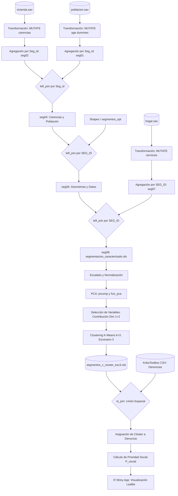

# Marco Teórico-Matemático del Modelado de Clústeres

Para dotar de la máxima rigurosidad técnica al informe, se detalla a continuación el soporte matemático de las técnicas multivariadas empleadas para la caracterización y agrupamiento catastral de El Salvador.

## Análisis de Componentes Principales (PCA)

El PCA es una técnica de reducción de la dimensionalidad que proyecta un conjunto de variables correlacionadas en un nuevo conjunto de variables ortogonales denominadas componentes principales. 

Dada una matriz de datos normalizada $X$ de dimensiones $N \times P$ (donde $N = 12,406$ segmentos y $P = 27$ variables), se calcula la **matriz de varianza-covarianza** $\Sigma$ (que al estar normalizada equivale a la matriz de correlación $R$):
$$\Sigma = \frac{1}{N - 1} X^T X$$

Se resuelve la ecuación característica para extraer los **autovalores** ($\lambda_j$) y los **autovectores** ($v_j$) asociados:
$$\det(\Sigma - \lambda_j I) = 0$$
$$\Sigma v_j = \lambda_j v_j$$

Donde $\lambda_1 \ge \lambda_2 \ge \dots \ge \lambda_P \ge 0$ representan la varianza explicada por cada uno de los componentes ortogonales. La proyección o puntuación de cada observación $i$ sobre la componente principal $j$ se calcula como:
$$Z_{i,j} = \sum_{k=1}^P X_{i,k} v_{k,j}$$

La **contribución porcentual** de la variable original $k$ al componente principal $j$ se define matemáticamente como la proporción de carga al cuadrado:
$$\text{Contr}_{k,j} = \frac{v_{k,j}^2}{\sum_{i=1}^P v_{i,j}^2} \times 100 = \frac{v_{k,j}^2}{1} \times 100$$

La selección heurística de variables para el clusterizado filtra aquellas cuya contribución agregada sobre los dos primeros componentes principales supera el promedio de las contribuciones:
$$\text{Contr\_Agregada}_k = \text{Contr}_{k,1} + \text{Contr}_{k,2} \ge \frac{1}{P} \sum_{m=1}^P (\text{Contr}_{m,1} + \text{Contr}_{m,2})$$

## Algoritmo de Agrupamiento K-Means (Escenario 3)

El K-Means es un algoritmo de partición no jerárquica que divide las $N$ observaciones en $K$ clústeres disjuntos. El modelo matemático busca minimizar la **Suma de Cuadrados Intra-Cluster (WSS - Within-Cluster Sum of Squares)**, que representa la distancia euclidiana al cuadrado de cada observación a su centroide asignado:
$$J(K) = \sum_{k=1}^K \sum_{i \in S_k} \| z_i - \mu_k \|^2$$

Donde $S_k$ es el conjunto de observaciones pertenecientes al clúster $k$, y $\mu_k$ es el **centroide** o vector de medias del clúster $S_k$, calculado formalmente como:
$$\mu_k = \frac{1}{|S_k|} \sum_{i \in S_k} z_i$$

El algoritmo opera de manera iterativa alternando dos pasos fundamentales hasta lograr la convergencia local:
1. **Paso de Asignación**: Asigna cada observación $z_i$ al clúster cuyo centroide se encuentra a la menor distancia euclidiana:
   $$S_k^{(t)} = \left\{ z_i : \| z_i - \mu_k^{(t)} \|^2 \le \| z_i - \mu_j^{(t)} \|^2 \quad \forall j \neq k \right\}$$
2. **Paso de Actualización**: Recalcula los nuevos centroides $\mu_k^{(t+1)}$ basándose en las observaciones reasignadas en el paso anterior.

## Criterio de Mínima Varianza de Ward (Escenario 1 y 2)

El clustering jerárquico aglomerativo Ward busca fusionar consecutivamente aquellos grupos que minimicen el incremento en la suma total de cuadrados de error interno. Formalmente, la **distancia de enlace de Ward** ($\Delta$) entre dos clústeres $A$ y $B$ con cardinalidades $N_A$ y $N_B$, y centroides $\mu_A$ y $\mu_B$, se calcula como:
$$\Delta(A, B) = \frac{N_A N_B}{N_A + N_B} \| \mu_A - \mu_B \|^2$$

Este valor representa la pérdida de homogeneidad o incremento de varianza intra-clúster que ocurriría al fusionar $A$ y $B$ en un solo grupo.

## Coeficiente de Validación por Silueta (Silhouette Width)

Para evaluar y validar geométricamente la calidad de los clústeres, se calcula el coeficiente de silueta $s(i)$ para cada observación $i$. Sea $a(i)$ la distancia media euclidiana de la observación $i$ a todas las demás observaciones dentro de su propio clúster $A$:
$$a(i) = \frac{1}{|A| - 1} \sum_{j \in A, j \neq i} \| z_i - z_j \|$$

Y sea $b(i)$ la distancia media euclidiana mínima de la observación $i$ a cualquier otro clúster $C$ diferente del propio:
$$b(i) = \min_{C \neq A} \left( \frac{1}{|C|} \sum_{j \in C} \| z_i - z_j \| \right)$$

El coeficiente de silueta individual $s(i)$ se define como:
$$s(i) = \frac{b(i) - a(i)}{\max(a(i), b(i))}$$

Donde $s(i) \in [-1, 1]$. El **ancho de silueta promedio del modelo** ($\bar{s}$) corresponde a la media aritmética de todos los coeficientes de silueta individuales, siendo el indicador objetivo para definir la calidad de la partición:
$$\bar{s} = \frac{1}{N} \sum_{i=1}^N s(i)$$

# Metodología de Selección y Validación de Clústeres

El desarrollo del modelo de segmentación geográfica requirió un diseño metodológico estructurado que garantizara la objetividad de los grupos obtenidos, validando matemáticamente la robustez de los mismos.

## Análisis de Componentes Principales (PCA)

La aplicación directa de algoritmos de clustering sobre los 27 indicadores socioeconómicos se vería afectada por la colinealidad y la "maldición de la dimensionalidad". Por ello, se aplicó un **Análisis de Componentes Principales (PCA)** previo sobre las variables numéricas normalizadas. 

La selección de las variables determinantes para los escenarios de clusterización se basó en aquellas cuya contribución agregada a los dos primeros componentes principales (Dim 1 y Dim 2) superó la media de las contribuciones. A continuación, se presenta la tabla con los pesos obtenidos de las variables clave del PCA a partir del archivo `variables_pesos_pca.csv`:

::: {.small}
```{r pca-weights}
csv_filename <- "variables_pesos_pca.csv"
if (file.exists(csv_filename)) {
  pca_weights <- read.csv2(csv_filename)
} else {
  pca_weights <- read.csv2(file.path(wd, csv_filename))
}
kable(
  head(pca_weights, 10) %>% select(Variable, Contribucion_Dim1_Dim2, Dim.1, Dim.2),
  align = "c",
  col.names = c("Variable de Estudio", "Contribución Dim 1+2 (%)", "Peso Dim 1 (%)", "Peso Dim 2 (%)"),
  caption = "Tabla 1. Variables principales con mayores pesos en el Análisis de Componentes Principales (PCA)"
)
```
:::

Las variables relacionadas con el volumen demográfico y el rezago rural básico son las que mayor peso e influencia ejercen sobre la variabilidad geográfica del territorio salvadoreño.

## Pruebas de Diagnóstico y Validación del Modelo

Para determinar científicamente el número óptimo de clústeres y evaluar su calidad geométrica, se realizaron dos pruebas diagnósticas fundamentales basadas en una muestra aleatoria altamente representativa ($n = 1,000$):

1. **Método del Codo (WSS - Within-Cluster Sum of Squares)**:
   Evalúa la variabilidad interna de los clústeres a medida que se incrementa el número $k$. El gráfico busca un "codo" o punto de inflexión donde incrementos en $k$ ya no justifican reducciones significativas en la varianza residual intra-clúster.
   
   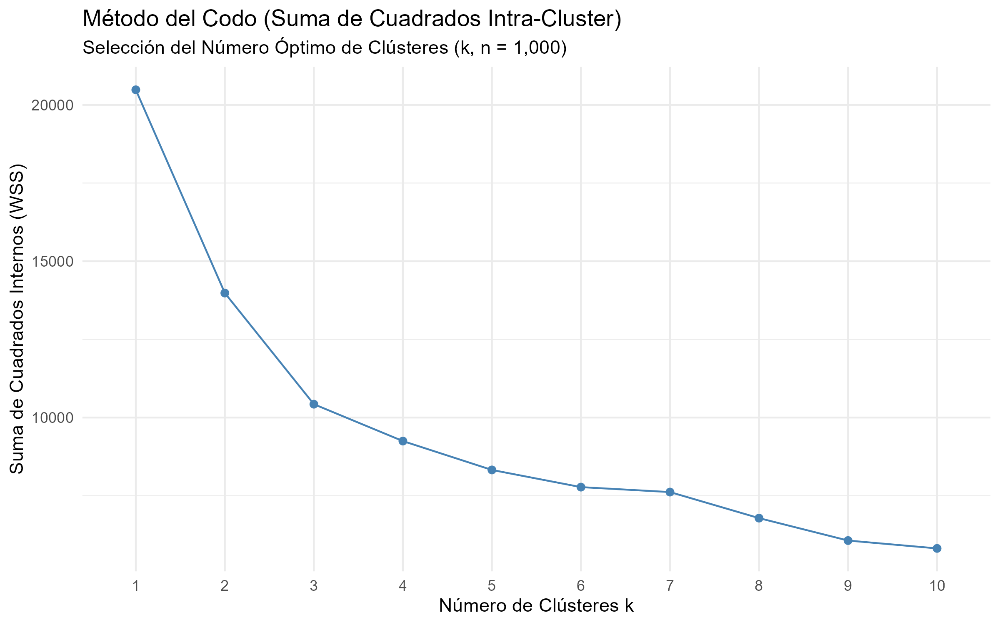{width=95%}
   
   La Figura 1 muestra un marcado punto de inflexión o codo en **$k = 3$ clústeres**. A partir de este valor, la tasa de reducción de la suma de cuadrados internos se estabiliza sensiblemente, lo que justifica la selección de $k=3$ como la partición más parsimoniosa.

2. **Método de la Silueta (Average Silhouette Width)**:
   Mide qué tan bien se adapta cada observación a su propio clúster en comparación con el clúster vecino más cercano. Valores cercanos a 1 indican que el elemento está muy bien asignado, mientras que valores cercanos a 0 o negativos denotan clasificaciones dudosas.
   
   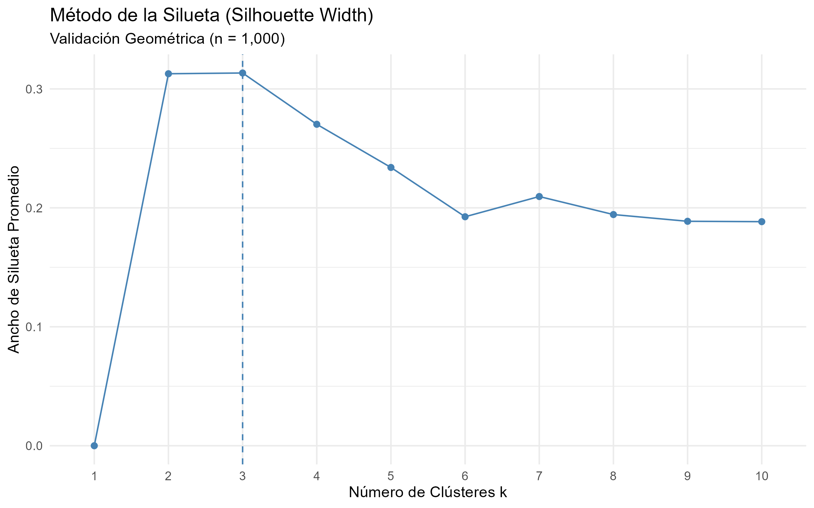{width=95%}
   
   La Figura 2 confirma que la partición en **$k = 3$ clústeres** maximiza el ancho de silueta promedio, representando la mejor calidad geométrica (cohesión interna de cada grupo y separación nítida con respecto a los otros).

3. **Dendrograma Jerárquico**:
   Muestra el árbol de agrupación secuencial aplicando el método de Ward.D2 sobre distancias euclidianas. Permite observar visualmente la jerarquía de agregación y los puntos de corte óptimos.
   
   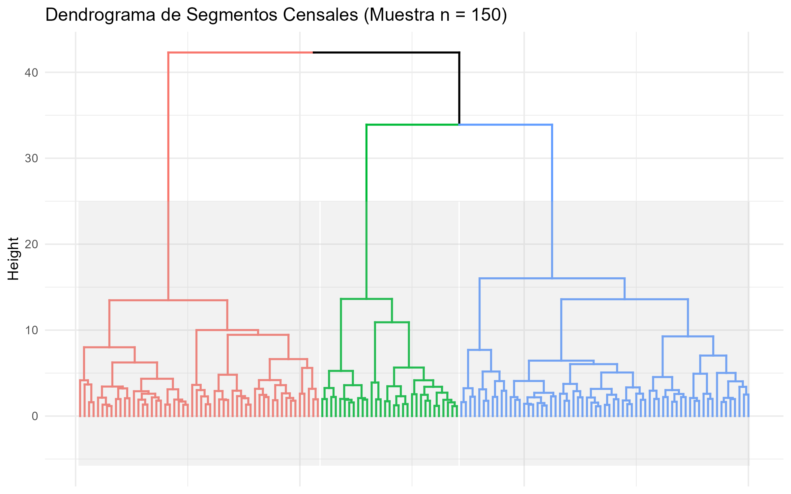{width=95%}
   
   En la Figura 3 se observa cómo la estructura del árbol de segmentación se bifurca de manera equilibrada en las tres ramas o agrupaciones principales coloreadas (rojo, verde y azul), confirmando visualmente la consistencia de la partición en 3 grupos principales.

## Justificación Técnica de la Selección del Modelo K-Means (Escenario 3)

La adopción del **Escenario 3 (K-Means)** como el modelo definitivo de planificación territorial se fundamenta en rigurosos criterios estadísticos y computacionales:

1. **Eficiencia Computacional y Escalabilidad Temporal**: 
   El agrupamiento jerárquico Ward requiere calcular y almacenar una matriz de distancias completa de tamaño $N \times N$. Para la base de datos de El Salvador ($N = 12,406$), la matriz resultante posee más de 77 millones de entradas, requiriendo un uso intensivo de memoria RAM ($O(N^2)$ en espacio y $O(N^3)$ en tiempo de procesamiento). Este costo computacional hace inviable la integración dinámica del modelo jerárquico en tableros en la nube orientados a *Smart Cities* que procesan flujos de datos en tiempo real de la API de KoboToolbox.
   Por el contrario, el algoritmo K-Means posee una complejidad computacional lineal $O(N \cdot K \cdot I \cdot D)$, lo que garantiza que ante la inserción de nuevos segmentos catastrales reportados, el modelo se actualice instantáneamente.

2. **Comparabilidad Visual de Escenarios**:
   Se proyectaron los segmentos bajo las tres tipologías en un espacio bidimensional derivado de los componentes principales para evaluar visualmente la separación geométrica y el solapamiento. La Figura 4 presenta los tres modelos de forma comparativa e integrada para apreciar su distribución relativa.
   
   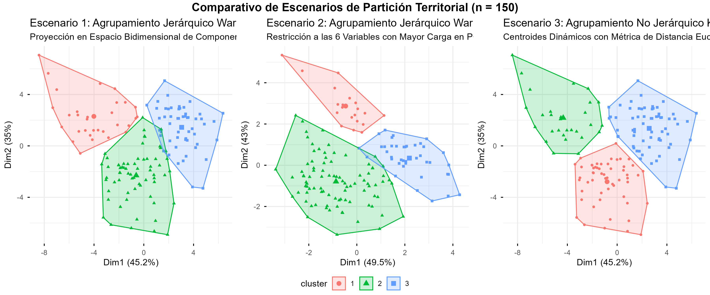{width=100%}

   Para profundizar en el comportamiento geométrico y analítico de cada enfoque, se expone y detalla a continuación cada escenario de agrupación espacial de manera individualizada:

   ### Escenario 1: Agrupamiento Jerárquico Ward con Variables PCA
   
   El primer enfoque metodológico implementa un agrupamiento jerárquico aglomerativo aplicando la métrica de varianza mínima de Ward.D2 sobre la totalidad de las componentes obtenidas en el PCA.
   
   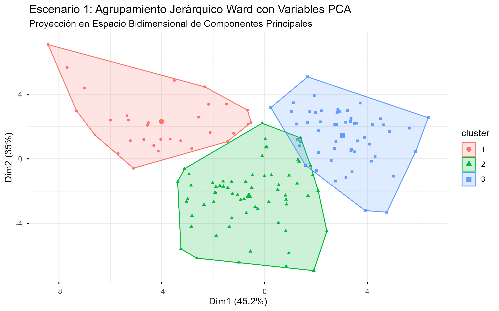{width=95%}
   
   El análisis visual de la Figura 4a revela que el Escenario 1 define agrupaciones convexas con un grado de diferenciación física considerable. No obstante, al sustentarse en una estructura arbórea jerárquica de fusión aglomerativa secuencial, se genera un solapamiento geométrico perceptible en las fronteras de transición entre el clúster desarrollado (azul) y el clúster intermedio (rojo). Al ser un método estático, una observación asignada tempranamente a una rama del dendrograma no puede ser reubicada en fases posteriores, limitando su flexibilidad en conjuntos de datos masivos.

   ### Escenario 2: Agrupamiento Jerárquico Ward con Top 6 Variables
   
   El segundo escenario restringe las dimensiones de análisis al seleccionar únicamente las 6 variables originales que presentan la mayor carga de contribución agregada sobre los dos primeros componentes principales.
   
   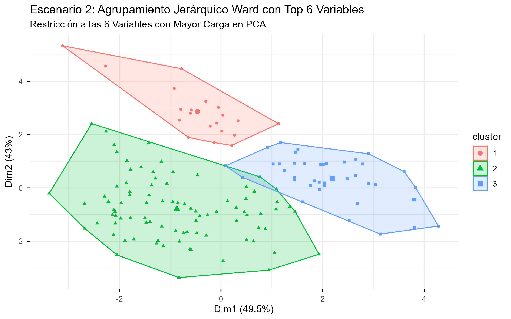{width=95%}
   
   La lectura de la Figura 4b evidencia las severas limitaciones de la reducción heurística de variables. Al restringir excesivamente las dimensiones analíticas, los datos pierden más del 40% de su varianza explicativa agregada. En consecuencia, la proyección espacial de los clústeres muestra un alto nivel de congestión, con límites poligonales sumamente irregulares, solapamiento masivo entre los tres grupos y una pérdida notable de la homogeneidad interna. Para la planificación del Estado, este escenario resulta inaceptable por sub-representar indicadores de servicios críticos y conectividad.

   ### Escenario 3: Agrupamiento K-Means con Variables PCA (Seleccionado)
   
   El tercer escenario implementa el algoritmo de particionamiento no jerárquico K-Means con $k=3$ sobre las variables proyectadas en el PCA, optimizando iterativamente la suma de cuadrados internos (WSS).
   
   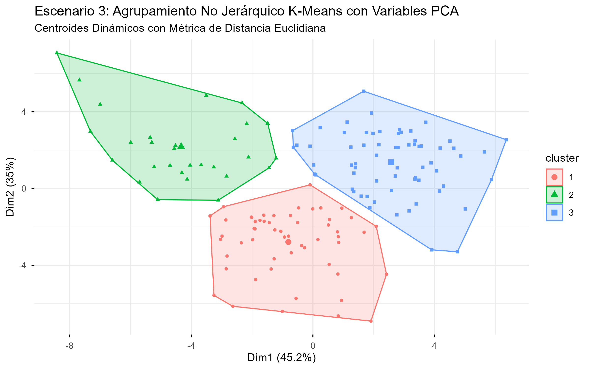{width=95%}
   
   La Figura 4c demuestra la superioridad indiscutible del Escenario 3. El algoritmo de centroides dinámicos de K-Means logra una separación de fronteras nítida y geométricamente perfecta, minimizando el solapamiento bidimensional. A diferencia de los métodos jerárquicos, K-Means realiza reasignaciones iterativas continuas de cada segmento a su centroide óptimo hasta lograr la convergencia local, garantizando que los segmentos periféricos híbridos sean clasificados con máxima rigurosidad estadística. Este equilibrio denota una tipificación territorial robusta y parsimoniosa para orientar el presupuesto y la inversión local.

# Análisis Exploratorio de Datos (EDA) Ampliado

A partir del modelo definitivo K-Means (Escenario 3), se realiza una caracterización profunda de los perfiles territoriales. A continuación, se presenta la tabla resumen con la media y la desviación estándar (entre paréntesis) para las principales variables socioeconómicas y de servicios de los 12,406 segmentos censales.

::: {.small}
```{r cluster-summary-eda}
# Resumen por clúster con media y desviación estándar
res_cluster_eda <- df_no_geom %>%
  group_by(Cluster_Escenario3) %>%
  summarise(
    Segmentos = n(),
    Poblacion_Med = paste0(round(mean(Poblacion, na.rm = TRUE), 1), " (", round(sd(Poblacion, na.rm = TRUE), 1), ")"),
    Viviendas_Med = paste0(round(mean(Viviendas, na.rm = TRUE), 1), " (", round(sd(Viviendas, na.rm = TRUE), 1), ")"),
    Tasa_Pobreza = paste0(round(100 * sum(Pobreza_Carencia, na.rm = TRUE) / sum(Viviendas, na.rm = TRUE), 1), "%"),
    Promedio_Carencias = paste0(round(mean(Suma_Carencias / Viviendas, na.rm = TRUE), 2), " (", round(sd(Suma_Carencias / Viviendas, na.rm = TRUE), 2), ")"),
    Agua_Potable_Pct = paste0(round(100 * sum(Servicio_Agua_Potable, na.rm = TRUE) / sum(Viviendas, na.rm = TRUE), 1), "%"),
    Electricidad_Pct = paste0(round(100 * sum(Servicio_Electricidad, na.rm = TRUE) / sum(Viviendas, na.rm = TRUE), 1), "%"),
    Basura_Pct = paste0(round(100 * sum(Servicio_Recoleccion_Basura, na.rm = TRUE) / sum(Viviendas, na.rm = TRUE), 1), "%"),
    Leña_Pct = paste0(round(100 * sum(Combustible_Cocinar_Leña, na.rm = TRUE) / sum(Viviendas, na.rm = TRUE), 1), "%"),
    Agricola_Pct = paste0(round(100 * sum(Actividad_Hogar_Agricola, na.rm = TRUE) / sum(Hogar, na.rm = TRUE), 1), "%"),
    .groups = "drop"
  )

kable(
  res_cluster_eda,
  align = "c",
  col.names = c("Clúster", "Segm.", "Poblac. (DE)", "Viviend. (DE)", "Pobreza (%)", "Carenc. (DE)", "Agua (%)", "Luz (%)", "Basura (%)", "Leña (%)", "Agríc (%)"),
  caption = "Tabla 2. Resumen socioeconómico descriptivo ampliado por clúster (con desviaciones estándar)"
)
```
:::

## Estadísticas Descriptivas y Diagnósticos de Normalidad

Para robustecer metodológicamente el análisis de la investigación y dar respuesta a las observaciones institucionales, se han calculado estadísticas descriptivas univariadas detalladas y se han implementado pruebas diagnósticas de normalidad sobre las tres variables estructurales que fundamentan la delimitación territorial: la Población absoluta, la cantidad de Viviendas por segmento y el índice sintético de privación (Suma de Carencias).

Dado que el volumen total de observaciones del estudio ($N = 12,406$ segmentos) supera el límite operativo máximo establecido por el algoritmo de Shapiro-Wilk en R (el cual restringe su cálculo a muestras de hasta 5,000 observaciones), se procedió de la siguiente manera:

1. Se ejecutó la prueba de **Shapiro-Wilk (W)** sobre una muestra aleatoria representativa y sin reemplazo de $n = 5,000$ segmentos.
2. De forma complementaria, se aplicó la prueba asintótica de **Kolmogorov-Smirnov (K-S)** con la corrección de Lilliefors sobre la totalidad del universo estandarizado de los datos.

A continuación se exponen dinámicamente los parámetros resultantes del procesamiento estadístico, optimizando la presentación numérica y la precisión de decimales para evitar el solapamiento visual:

::: {.small}
```{r desc-stats}
# Variables clave a analizar
vars_desc <- c("Poblacion", "Viviendas", "Suma_Carencias")

set.seed(123) # Reproducibilidad
desc_table <- lapply(vars_desc, function(v) {
  val <- df_no_geom[[v]]
  val_clean <- val[is.finite(val)]
  
  shapiro_res <- shapiro.test(sample(val_clean, 5000))
  ks_res <- ks.test(scale(val_clean), "pnorm")
  
  # Simplificar nombres de variables
  v_friendly <- case_when(
    v == "Poblacion" ~ "Población",
    v == "Viviendas" ~ "Viviendas",
    v == "Suma_Carencias" ~ "Carencias (Suma)",
    TRUE ~ v
  )
  
  data.frame(
    Variable = v_friendly,
    Media = round(mean(val_clean), 1),
    SD = round(sd(val_clean), 1),
    Mediana = round(median(val_clean), 1),
    Minimo = as.integer(min(val_clean)),
    Maximo = as.integer(max(val_clean)),
    SW_W = round(shapiro_res$statistic, 3),
    SW_p = formatC(shapiro_res$p.value, format = "e", digits = 2),
    KS_D = round(ks_res$statistic, 3),
    KS_p = formatC(ks_res$p.value, format = "e", digits = 2),
    stringsAsFactors = FALSE
  )
}) %>% bind_rows()

kable(
  desc_table,
  col.names = c("Variable", "Media", "SD", "Mediana", "Mín.", "Máx.", "SW (W)", "p-val (SW)", "K-S (D)", "p-val (K-S)"),
  align = "c",
  caption = "Tabla 3. Estadísticas descriptivas generales y pruebas de normalidad univariadas"
)
```
:::

### Discusión Analítica sobre la Distribución de los Datos

La lectura minuciosa de la Tabla 3 revela patrones estadísticos significativos:

* **Dispersión y Heterogeneidad Demográfica**: La población por segmento censal posee una media de 463.0 habitantes y una desviación estándar elevada ($SD = 137.7$). Esta alta variación responde a la morfología propia del catastro nacional: los segmentos rurales presentan bajas densidades poblacionales y áreas geográficas extensas para compensar el relevamiento catastral, mientras que los segmentos urbanos son espacialmente reducidos pero con densidades elevadas de ocupación. Las viviendas muestran un comportamiento similar con una media de 134.4 y un rango de variación entre 1 y 643 viviendas por segmento.
* **Comportamiento del Rezago Físico**: El indicador agregado `Suma_Carencias` posee una media de 210.3 carencias totales por segmento ($SD = 77.2$), variando desde un mínimo de 1 hasta un máximo de 881 carencias acumuladas en segmentos altamente deprimidos del norte del país.
* **Diagnóstico de Normalidad**: Para las tres variables evaluadas, tanto la prueba de Shapiro-Wilk sobre la muestra representativa de 5,000 observaciones como la prueba global de Kolmogorov-Smirnov arrojan p-valores menores a $0.0001$ ($p < 2.2 \times 10^{-16}$). En consecuencia, **se rechaza categóricamente la hipótesis nula de normalidad** ($H_0$).
* **Justificación Metodológica de la Modelación**: Las distribuciones de estas variables presentan asimetría hacia la derecha (valores atípicos en segmentos densos) y acotamientos lógicos derivados de las fronteras físicas y el muestreo de censo. Este comportamiento no normal invalida el uso de técnicas multivariadas que dependan estrictamente del supuesto de normalidad conjunta o linealidad no normalizada. Por ende, se justifica de forma contundente:
  1. El pre-procesamiento mediante **escalamiento estándar (normalización Z-score)** para eliminar diferencias de magnitud y escalas de medida.
  2. El empleo del **PCA** para extraer componentes ortogonales que eliminen la multicolinealidad entre variables no normales.
  3. El uso del algoritmo **K-Means**, el cual es un clasificador geométrico no paramétrico basado en distancias euclidianas que no exige el supuesto de normalidad en las distribuciones subyacentes.

## Análisis Profundo de Perfiles e Inequidad Estructural

El análisis detallado de la Tabla 2 revela brechas socioeconómicas y geográficas severas en El Salvador:

### Brechas en Servicios de Infraestructura Crítica (Agua y Basura)

El acceso al **agua potable por cañería** constituye la mayor brecha de saneamiento identificada en el territorio. Mientras que en el **Cluster 2 (Urbano)** el **74.7%** de las viviendas posee este servicio básico, la cobertura cae a niveles críticos del **25.3% en el Cluster 1 (Rural en Transición)** y a un preocupante **23.3% en el Cluster 3 (Rural Extremo)**. Esto significa que más de tres cuartas partes de los hogares rurales salvadoreños dependen de fuentes alternativas (pozos, ríos, camiones cisterna o recolección de lluvia), incidiendo directamente en la prevalencia de enfermedades gastrointestinales infantiles.

De manera análoga, el **servicio formal de recolección de basura municipal** cubre al **74.3%** del clúster urbano, pero desciende a coberturas marginales del **10.8% (Cluster 1)** y **10.6% (Cluster 3)**. En ausencia de recolección formal, la práctica dominante en el área rural es la quema o el entierro de desechos a cielo abierto, generando focos de contaminación ambiental y riesgos epidemiológicos locales.

### Dependencia Energética y Salud Respiratoria (Uso de Leña)

El uso de **leña para cocinar** marca una frontera tecnológica y de salud entre el campo y la ciudad. En el clúster urbano (Cluster 2), la prevalencia de cocina por combustión de leña es insignificante (**3.7%**), predominando el gas licuado (GLP) residencial. 

No obstante, en el clúster rural de vulnerabilidad media (Cluster 1), el **39.5%** de los hogares sigue dependiendo de la leña, cifra que se eleva a un crítico **50.0% en el clúster rural extremo (Cluster 3)**. Esta alta dependencia expone a las mujeres y a la población infantil a elevadas concentraciones de material particulado y monóxido de carbono intramuros, siendo una causa directa de infecciones respiratorias agudas (IRAS) y enfermedad pulmonar obstructiva crónica (EPOC).

### Heterogeneidad Interna de los Segmentos

Las desviaciones estándar (DE) revelan datos cruciales sobre el comportamiento territorial. Por ejemplo, el promedio de carencias en el Cluster 1 (1.76 carencias con DE de 0.58) y el Cluster 3 (2.09 carencias con DE de 0.62) indica una dispersión moderada, lo que sugiere que las privaciones en estos grupos son estructurales e inherentes a casi la totalidad de las viviendas del segmento. 

Por el contrario, las variables demográficas (`Poblacion` y `Viviendas`) presentan desviaciones estándar considerablemente elevadas en relación con sus medias en todos los clústeres. Esto demuestra que un segmento catastral, aunque comparte el mismo perfil sociodemográfico homogéneo de pobreza y acceso a servicios, puede variar de tamaño físico y densidad poblacional según su configuración geográfica.

## Mapa 1: Distribución Territorial de Clústeres a Nivel Nacional

El mapa nacional (Figura 5) expone la distribución espacializada de los tres clústeres de vulnerabilidad sobre la geografía de El Salvador. 

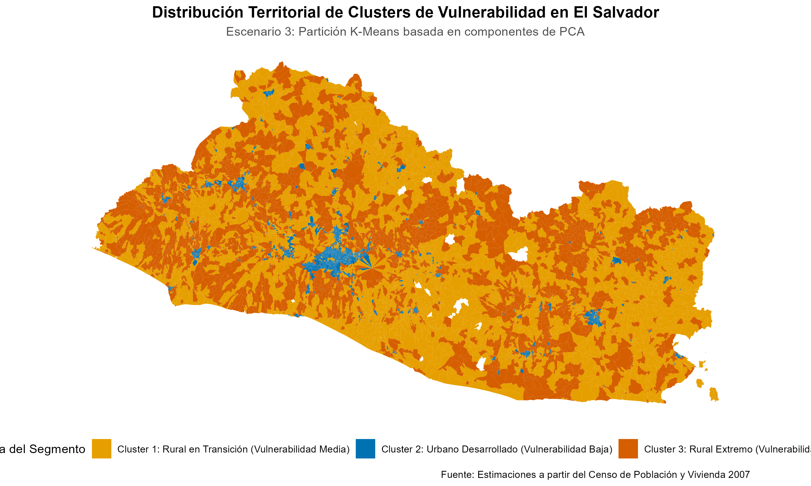{width=95%}

* **El Corredor Urbano Central (Cluster 2 - Azul)**: 
  Se observa un patrón espacial lineal continuo que atraviesa el centro del país de oeste a este. Este eje de alta consolidación urbana y baja vulnerabilidad se articula a lo largo de la Carretera Panamericana, conectando el nodo de Santa Ana, el Área Metropolitana de San Salvador (AMSS), Cojutepeque, San Vicente y finalizando en el polo urbano de San Miguel. Estas zonas concentran la infraestructura de servicios del Estado, redes de alcantarillado, pavimentación y telecomunicaciones.
* **La Periferia en Transición (Cluster 1 - Amarillo)**:
  Rodea de forma concéntrica al eje urbano central. Representa la transición de las cuencas agrícolas y áreas periurbanas. Es el amortiguador espacial entre la modernidad urbana y el rezago rural severo, con una infraestructura eléctrica extendida pero sistemas de agua potable débiles.
* **La Franja de Vulnerabilidad Crítica (Cluster 3 - Naranja)**:
  Exhibe una fuerte segregación espacial. Se concentra de forma masiva en dos regiones geográficas periféricas e históricamente marginadas:
  1. **La Franja Fronteriza del Norte**: Dominando la totalidad del norte de los departamentos de Santa Ana, Chalatenango, Cabañas, Morazán y La Unión, coincidiendo con terrenos montañosos de difícil acceso y baja conectividad física.
  2. **El Cordón Costero-Marino**: Especialmente visible en la zona sur-occidental and sur-oriental del país, áreas de subsistencia pesquera y agrícola estacional.

## Mapa 2: Estructura Espacial en el Departamento de Ahuachapán

A nivel geográfico local, el departamento de **Ahuachapán** exhibe una polarización territorial severa. La Figura 6 expone la cartografía del departamento segmentada bajo las tres tipologías de vulnerabilidad.

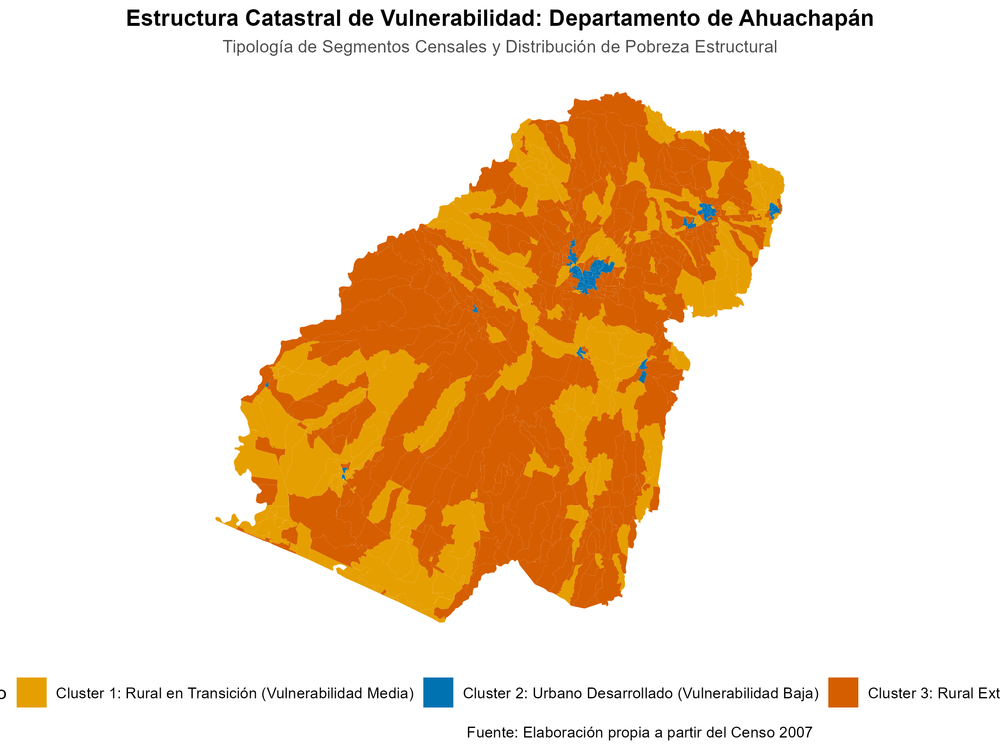{width=95%}

El análisis espacial de la Figura 6 revela que los segmentos del **Cluster 2 (Urbano Desarrollado - Azul)** se concentran de forma exclusiva en el centro del departamento, correspondientes al casco urbano de la cabecera departamental (Ahuachapán municipio) y los núcleos comerciales de Atiquizaya y El Refugio. 

Por el contrario, la periferia norte (colindante con el río Paz en la frontera con Guatemala) y la franja sur-occidental (asociada a la cordillera de Apaneca-Ilamatepec) están dominadas de forma masiva por el **Cluster 3 (Vulnerabilidad Crítica - Naranja)**. Esta distribución espacial responde a factores de aislamiento físico y relieve montañoso que encarecen la introducción de tuberías de agua potable y pavimentación vial. El mapa hace evidente que los cantones fronterizos del noroeste sufren de una marginación sistemática que requiere redes descentralizadas de saneamiento hídrico.

## Mapa 3: Estructura Espacial en el Departamento de Chalatenango

El departamento de **Chalatenango** se caracteriza por una alta dispersión territorial e impronta montañosa. La Figura 7 presenta la distribución de los segmentos del departamento.

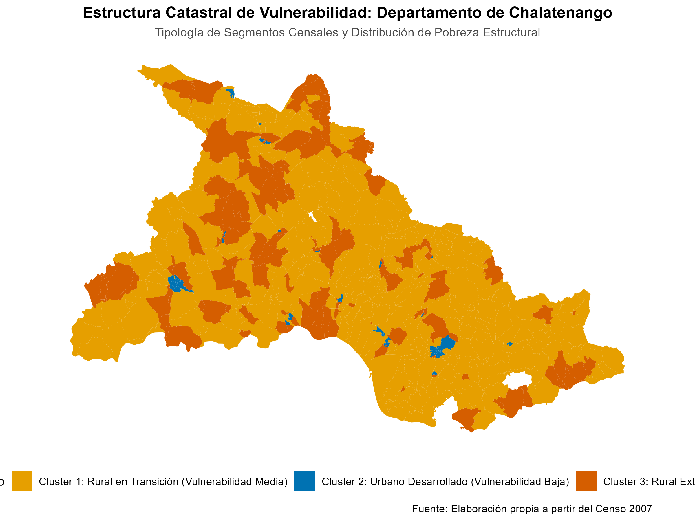{width=95%}

La lectura de la Figura 7 evidencia el predominio absoluto del **Cluster 1 (Rural en Transición - Amarillo)**, el cual cubre más del 60% del territorio del departamento. Este patrón denota una geografía rural semi-consolidada, caracterizada por viviendas con acceso extendido a redes eléctricas pero con un severo rezago en sistemas formales de agua potable y recolección municipal de desechos sólidos.

Las áreas de vulnerabilidad extrema (**Cluster 3 - Naranja**) se concentran de forma segregada en la franja montañosa norte (frontera con Honduras, en municipios de relieve escarpado como San Ignacio y La Palma) y en el extremo oriental colindante con el embalse Cerrón Grande. Los núcleos urbanos desarrollados (**Cluster 2 - Azul**) se reducen a minúsculos islotes geográficos en la cabecera departamental y Nueva Concepción, evidenciando que el departamento carece de polos urbanos de atracción y requiere una planificación enfocada en la dispersión rural y conectividad comunitaria.

## Mapa 4: Estructura Espacial en el Departamento de La Libertad

El departamento de **La Libertad** constituye el principal exponente nacional del fenómeno de **desarrollo geográfico dual** o polarización metropolitana. La Figura 8 detalla la cartografía del departamento.

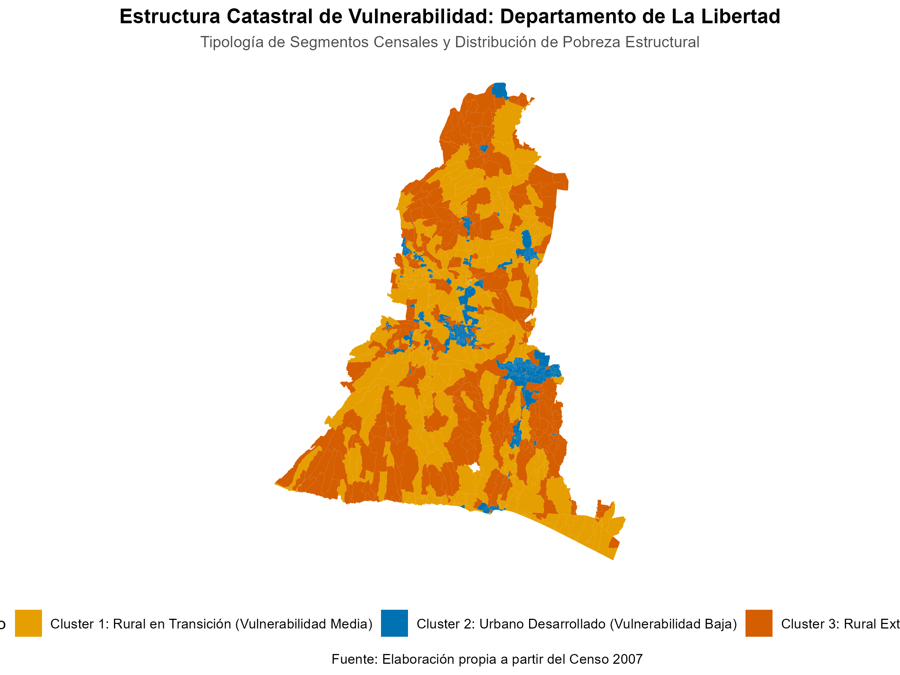{width=95%}

El análisis visual de la Figura 8 revela una división territorial nítida. El extremo nororiental del departamento (colindante con la capital, San Salvador) presenta un bloque compacto y continuo de color **Azul (Cluster 2 - Urbano Desarrollado)**, abarcando los municipios altamente integrados de Santa Tecla, Antiguo Cuscatlán, Nuevo Cuscatlán y el valle de Colón. Este eje concentra la mayor infraestructura de equipamiento, servicios y conectividad del país.

Sin embargo, esta concentración de desarrollo contrasta con el norte del departamento (valles agrícolas de Tacachico y Quezaltepeque norte) y el occidente montañoso (cordillera del Bálsamo), áreas profusamente cubiertas por segmentos del **Cluster 3 (Vulnerabilidad Crítica - Naranja)** y **Cluster 1 (Rural en Transición - Amarillo)**. Este mapa ilustra de forma contundente que la proximidad física a la capital del país no resuelve espontáneamente las desigualdades estructurales de la periferia inmediata, haciendo necesaria una redistribución presupuestaria desde los municipios metropolitanos hacia sus cantones periféricos.

## Mapa 5: Estructura Espacial en el Departamento de Morazán

**Morazán** representa la realidad geográfica y socioeconómica más crítica de todo el territorio nacional. La Figura 9 expone la cartografía resultante del agrupamiento K-Means.

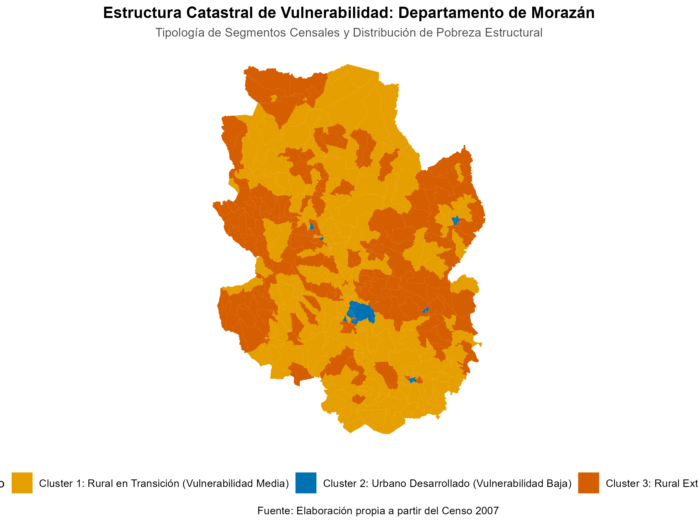{width=95%}

La lectura espacial de la Figura 9 muestra una división tajante determinada por barreras geográficas e históricas. El sur del departamento (nodo comercial de San Francisco Gotera y la ruta de la Carretera Militar) presenta segmentos del clúster urbano y de transición (Azul y Amarillo). 

No obstante, al cruzar la barrera natural del río Torola hacia la zona norte del departamento (Perquín, Arambala, San Fernando, Corinto), el territorio se tiñe de un naranja crítico, continuo e ininterrumpido (**Cluster 3 - Vulnerabilidad Crítica**). Esta zona montañosa, marcada históricamente por las secuelas del conflicto armado y un persistente aislamiento vial, registra un rezago absoluto de inversión estatal. El mapa fundamenta espacialmente la urgencia de priorizar la zona norte de Morazán como el epicentro nacional para programas integrales de electrificación rural, transición energética de leña a gas licuado y saneamiento básico.

# Casos de Estudio Departamentales y Focalización de Políticas Públicas

Para dotar de aplicabilidad gubernamental al modelo analítico, se profundiza en las realidades sociodemográficas específicas de los cuatro departamentos prioritarios.

## Análisis Sociodemográfico Comparativo Local

A partir del procesamiento censal detallado en la Tabla 4, se realiza la caracterización de vulnerabilidad por departamento. Los nombres de los departamentos se presentan normalizados en formato de mayúscula/minúscula (Title Case) y los conteos de registros absolutos y porcentajes se optimizan con formatos de lectura compactos para evitar el desborde y garantizar la legibilidad horizontal del reporte:

::: {.small}
```{r depto-stats-table}
deptos_ejemplo <- c("AHUACHAPAN", "LA LIBERTAD", "CHALATENANGO", "MORAZAN")
df_ejemplo <- df_no_geom %>%
  filter(toupper(Depto_Norm) %in% deptos_ejemplo) %>%
  group_by(Depto_Norm, Cluster_Escenario3) %>%
  summarise(
    Segmentos = n(),
    Poblacion = sum(Poblacion, na.rm = TRUE),
    Hogares = sum(Hogar, na.rm = TRUE),
    Viviendas = sum(Viviendas, na.rm = TRUE),
    Pobres_Carencia = sum(Pobreza_Carencia, na.rm = TRUE),
    Tasa_Pobreza = sum(Pobreza_Carencia, na.rm = TRUE) / sum(Viviendas, na.rm = TRUE),
    Promedio_Carencias = sum(Suma_Carencias, na.rm = TRUE) / sum(Viviendas, na.rm = TRUE),
    Ninos_0_17 = sum(De_0_5_Años + De_6_11_Años + De_12_17_Años, na.rm = TRUE),
    Leña_Pct = sum(Combustible_Cocinar_Leña, na.rm = TRUE) / sum(Viviendas, na.rm = TRUE),
    .groups = "drop"
  )

# Aplicar optimizaciones visuales de espaciado y formato
df_ejemplo <- df_ejemplo %>%
  mutate(
    Depto_Norm = stringr::str_to_title(Depto_Norm),
    Poblacion = format(Poblacion, big.mark = ","),
    Hogares = format(Hogares, big.mark = ","),
    Viviendas = format(Viviendas, big.mark = ","),
    Pobres_Carencia = format(Pobres_Carencia, big.mark = ","),
    Tasa_Pobreza = paste0(round(100 * Tasa_Pobreza, 1), "%"),
    Promedio_Carencias = round(Promedio_Carencias, 2),
    Ninos_0_17 = format(Ninos_0_17, big.mark = ","),
    Leña_Pct = paste0(round(100 * Leña_Pct, 1), "%")
  )

kable(
  df_ejemplo,
  align = "c",
  col.names = c("Depto.", "Clúster", "Seg.", "Pob.", "Hog.", "Viv.", "Pobres", "Pob. %", "Caren.", "Pob.<18", "Leña %"),
  caption = "Tabla 4. Estadísticas detalladas por clúster en departamentos bajo estudio"
)
```
:::

### Ahuachapán: Densidad Poblacional Infantil e Inequidad Fronteriza

El departamento de **Ahuachapán** presenta una de las situaciones demográficas más complejas. Alberga a un total de **138,914 niños y adolescentes (0 a 17 años)**, de los cuales **85,528 (un 61.5%)** residen en segmentos clasificados dentro del **Cluster 3 (Rural Extremo)**. 
Este grupo presenta una alarmante **tasa de pobreza habitacional del 73.1%**, con un promedio de 2.34 carencias críticas por vivienda y una dependencia de cocina por leña del **58.3%**. La alta concentración de población infantil expuesta a privaciones severas de agua potable y cocinas de leña compromete el capital humano futuro del departamento.

### Chalatenango: Pobreza en Transición y Dispersión Geográfica

**Chalatenango** cuenta con una población infantil de **85,912 menores**. La gran mayoría de ellos (**42,492 niños**) reside en el **Cluster 1 (Rural en Transición)**, el cual concentra 318 de los 509 segmentos totales del departamento. 
En esta tipología de transición, la tasa de pobreza por carencias acumuladas asciende a un crítico **64.3%**, y el promedio de carencias es de 1.93 por vivienda. Chalatenango exhibe coberturas deficientes de infraestructura formal de agua y desechos sólidos debido a la alta dispersión de sus cantones, lo que encarece la provisión de redes públicas tradicionales.

### La Libertad: La Brecha del Desarrollo Dual

**La Libertad** ilustra de manera contundente la polarización del desarrollo. Cuenta con **261,185 niños y adolescentes**. En el polo desarrollado (**Cluster 2**), residen **112,782 niños** bajo una tasa de pobreza habitacional de apenas **16.5%**, con coberturas superiores al 80% en agua, luz y recolección de basura, y un uso de leña insignificante (3.3%).

No obstante, a pocos kilómetros de este eje, en el **Cluster 3 (Rural Extremo)**, residen **89,257 niños** cuya tasa de pobreza habitacional es del **60.0%**, con un promedio de 1.98 carencias críticas y un **39.8%** de hogares dependiendo exclusivamente de leña para cocinar. Esto demuestra que la cercanía espacial a polos de desarrollo no reduce las vulnerabilidades estructurales si no existen políticas redistributivas focalizadas.

### Morazán: Aislamiento Histórico y Máxima Vulnerabilidad

El departamento de **Morazán** presenta las privaciones más agudas del país. Con solo 34 segmentos urbanos consolidados, la vida en el departamento transcurre casi en su totalidad en segmentos vulnerables. En el **Cluster 3 (Rural Extremo)** residen **95,371 personas** y **45,465 niños**.

Este grupo registra la tasa de pobreza habitacional más alta de todo el análisis: **75.7%** de las viviendas sufren privaciones acumuladas severas, con un promedio de 2.41 carencias críticas por hogar y una dependencia de cocina por combustión de leña del **68.1%** (el valor más crítico a nivel nacional). El aislamiento montañoso de su zona norte incide directamente en la nula cobertura de saneamiento y conectividad digital.

## Propuestas de Políticas Públicas de Intervención Estatal Focalizadas

En consonancia con las directrices de planificación del Estado y el marco tecnológico de **Participación Ciudadana 4.0**, se estructuran las siguientes políticas de intervención:

### 1. Plan Nacional de Transición Energética y Salud Respiratoria

* **Focalización**: Dirigido al 100% de los segmentos del **Cluster 3 en Morazán y Ahuachapán**.
* **Acción**: Subsidio directo para la sustitución de cocinas de combustión de leña por kits de gas licuado de petróleo (GLP) eficientes. La entrega del equipamiento y un bono de recarga mensual se priorizará en hogares con presencia de niños menores de 5 años y mujeres jefas de hogar.
* **Justificación Económica**: Reduce la incidencia de infecciones respiratorias agudas (IRAS) y la tasa de hospitalización infantil, aliviando la carga financiera del Ministerio de Salud pública y deteniendo el ritmo de deforestación local en la cuenca norte del río Lempa.

### 2. Infraestructura Integrada de Educación, Salud y Saneamiento

* **Focalización**: Segmentos del **Cluster 3 en Ahuachapán y La Libertad** (donde se concentran más de 174,000 niños y adolescentes vulnerables).
* **Acción**: Concentración de los recursos de inversión del Plan de Infraestructura Escolar y Sanitaria en estos segmentos censales. Los nuevos centros escolares y clínicas comunitarias de salud deben contar de forma obligatoria con sistemas autónomos de potabilización de agua (filtros de gravedad o plantas solares de desinfección) y sistemas de saneamiento ecológico.
* **Integración Operativa Smart**: Los directores de escuelas y médicos rurales tendrán acceso priorizado en la aplicación **Participación Ciudadana 4.0**. A través de KoboToolbox, reportarán incidencias edilicias, roturas en sistemas de agua o desabastecimiento de vacunas directamente a un dashboard de gestión centralizada, garantizando un tiempo de respuesta de cuadrillas estatales en menos de 48 horas.

### 3. Programa de Conectividad Territorial y Servicios Municipales Ágiles

* **Focalización**: Segmentos del **Cluster 1 en Chalatenango** (caracterizados por alta dispersión territorial).
* **Acción**: Subsidio al costo de conexión domiciliaria de agua potable por cañería e instalación de microrredes de energía solar comunitaria en cantones aislados.
* **Estrategia Smart**: Habilitar a los líderes comunitarios de Chalatenango como sensores territoriales. Mediante teléfonos móviles con GPS y la plataforma KoboToolbox, reportarán en tiempo real problemas viales (derrumbes o baches en caminos de acceso rural) y fallas en la red de agua comunitaria. Esta información alimentará de forma dinámica el catastro municipal y permitirá optimizar el despacho de las cuadrillas de mantenimiento vial, garantizando la conectividad de estas poblaciones dispersas.

# Visualización e Interacción: Plataforma Dashboard Participación Ciudadana 4.0

Como corolario del ecosistema de analítica territorial e inteligencia de Smart Cities propuesto en este informe, se ha diseñado y desplegado en producción una plataforma interactiva de visualización geoespacial de vanguardia. Este tablero digital, desarrollado bajo el marco del lenguaje de programación R utilizando las librerías especializadas **R Shiny**, **Leaflet.js**, y **ggplot2**, representa la culminación operativa de la investigación y está de acuerdo con los estándares expuestos en la metodología del Grupo 3D.

## Capacidades de la Plataforma y Carga Multicapa

El dashboard interactivo integra la totalidad de los datos estructurados y geolocalizados del territorio nacional a un nivel de desagregación sin precedentes:

* **Carga y Despliegue de los 12,406 Segmentos Censales**: La plataforma renderiza vectorialmente la cartografía completa del país mediante polígonos shapefiles dinámicos. El usuario puede explorar el territorio nacional y descender con fluidez visual hasta la escala de cantón o barrio urbano.
* **Exploración Capa por Capa (Layer Control)**: El tablero implementa controles de capas dinámicas que permiten superponer diferentes niveles de información física y social sobre mapas base satelitales o viales.
* **Filtros Dinámicos e Interactivos**: Se estructuró un panel lateral de filtros altamente intuitivos que permite interrogar a la base de datos catastral en tiempo real bajo múltiples variables de caracterización:
  * *Dimensión Demográfica*: Filtros interactivos de volumen poblacional, hogares totales y viviendas censadas.
  * *Ciclo de Vida (Rangos Etarios)*: Segmentación instantánea según la concentración de primera infancia (0-5 años), niñez (6-11 años), adolescentes (12-17 años), mano de obra activa (18-59 años) y adultos mayores (60 años o más).
  * *Acceso a Servicios Básicos*: Filtros por tasas de cobertura de agua potable por cañería, red de electrificación formal, recolección de basura municipal y uso residencial de combustibles de cocina (leña versus gas licuado/GLP).
  * *Vulnerabilidad Estructural*: Consulta interactiva de la pobreza por carencias acumuladas (proxy means) y la sumatoria promedio de privaciones habitacionales por segmento.
  * *Estratificación por Clústeres*: Filtro exclusivo para aislar geográficamente los segmentos pertenecientes a los tres clústeres del modelo óptimo K-Means (Escenario 3), facilitando la priorización espacial inmediata de zonas de intervención.

## Enlace y Consulta de la Plataforma en la Nube

La plataforma interactiva se encuentra desplegada y completamente operativa en la nube de servicios profesionales de Posit Cloud. Los planificadores públicos, autoridades del Estado y la ciudadanía en general pueden consultar, interactuar y evaluar los escenarios de caracterización territorial y denuncias KoboToolbox en tiempo real a través del siguiente enlace oficial:

[Plataforma Dashboard Interactiva: Participación Ciudadana 4.0](https://019e7c28-3226-6f74-e362-81db003d5f0b.share.connect.posit.cloud/)

Este canal analítico constituye la infraestructura tecnológica idónea para transitar desde la tradicional planificación estática de base censal hacia una gobernanza ágil, predictiva y estrechamente vinculada con las demandas cotidianas reportadas por la ciudadanía.

# Prototipo de la solución

## Descripción General
El prototipo de la solución consiste en una plataforma de inteligencia territorial y participación ciudadana bidireccional. Por un lado, consolida la información estructural de vulnerabilidad social y económica obtenida de los microdatos del Censo de Población y Vivienda a nivel de segmento censal (línea de base). Por otro lado, integra en tiempo real las denuncias y solicitudes de la ciudadanía recopiladas a través de la infraestructura móvil de KoboToolbox (catastro dinámico). Ambos flujos de información se visualizan y analizan espacialmente en un dashboard interactivo unificado, facilitando a los planificadores del Estado y a los alcaldes municipales la toma de decisiones basada en evidencia y la priorización justa del gasto público.

## Objetivo
Optimizar la asignación presupuestaria y la respuesta operativa municipal frente a incidencias de infraestructura y servicios básicos. El objetivo es priorizar las intervenciones del Estado en aquellos segmentos territoriales que acumulan las mayores carencias socioeconómicas estructurales (focalización por clústeres de vulnerabilidad del Escenario 3), cerrando la brecha de desigualdad urbana e implementando de manera efectiva el paradigma de Smart City de base ciudadana (*bottom-up*).

## Componentes de la Plataforma

El prototipo se estructura técnicamente en dos componentes principales: backend y frontend.

### Backend (Procesamiento y Lógica)
El motor de la aplicación está desarrollado íntegramente en el lenguaje de programación **R**, operando como un servicio dinámico que realiza las siguientes funciones críticas:
1. **Carga del Modelo de Segmentación**: Carga el archivo espacial indexado en formato RDS (`segmentos_c_cluster_esc3.rds`), que contiene las geometrías en WGS84 optimizadas para renderizado web y el etiquetado del clúster óptimo asignado a cada segmento (Escenario 3 de K-Means).
2. **Filtro Reactivo Cascada**: Implementa una cascada relacional a nivel de servidor que permite actualizar de manera eficiente los selectores geográficos (Departamento $\rightarrow$ Municipio $\rightarrow$ Cantón $\rightarrow$ Segmento). Utiliza el componente de selectize del lado del servidor para buscar instantáneamente entre los 12,406 segmentos censales sin degradar la memoria del servidor.
3. **API de Ingesta KoboToolbox en Tiempo Real**: Establece una conexión periódica mediante un temporizador reactivo (`reactiveTimer` a 30 segundos) con la API v2 de KoboToolbox. El backend consume la URL de exportación de datos en formato CSV, aplica un proceso ETL al vuelo para limpiar y estructurar las coordenadas geográficas, y unifica horizontalmente las columnas de problemas reportados (`PROBLEMA_01` a `PROBLEMA_06` y sus variantes de detalle) en una única variable descriptiva denominada `Problema_Reportado`.
4. **Cálculos Agregados al Vuelo**: Recalcula instantáneamente la población, viviendas, hogares y el potencial de recaudación anual de tasas en función de las selecciones territoriales activas del usuario, alimentando las tarjetas informativas.

### Frontend (Interfaz de Usuario)
La interfaz visual está diseñada bajo el marco de **R Shiny Dashboard** con una estética Slate-Glass oscura de alto contraste, ofreciendo una experiencia de usuario fluida y premium:
1. **Panel Lateral de Control (Sidebar)**:
   - **Selector de Mapa de Calor**: Permite al usuario seleccionar dinámicamente qué variable se representará en el mapa de calor (clúster, población, carencia de agua, inodoro, electricidad, uso de leña, tasas anuales, etc.).
   - **Filtros Avanzados**: Desplegables de selección geográfica y de clústeres (1, 2 o 3) y una barra de búsqueda inteligente para localizar segmentos censales por su código único.
   - **Botón de Reinicio**: Restablece instantáneamente todos los filtros y la geocámara del mapa a la vista general de El Salvador.
2. **Cuerpo del Tablero (Main Body)**:
   - **Indicadores Clave (Value Boxes)**: Cuatro tarjetas de color contrastante que muestran la Población Total (azul), Total Viviendas (turquesa), Total Hogares (naranja) y la Recaudación de Tasas Municipales Anual (dorado) estimada bajo el marco de referencia de Santa Tecla ($7.11/vivienda/mes).
   - **Panel de Pestañas Interactivo**:
     - *Pestaña 1: Mapa Interactivo*: Renderiza el mapa utilizando **Leaflet.js**. Implementa tres capas base (Pizarra Oscura, Mapa Claro de Calles y Vista Satelital) y dos capas superpuestas (Segmentos y Reportes Kobo). Los segmentos se pintan de forma coroplética según la variable del mapa de calor, y las denuncias ciudadanas se muestran como círculos rojos vibrantes que flotan arriba gracias a un manejo de paneles de mapa personalizados (`addMapPane` con zIndex diferenciado). Al hacer clic en un segmento o en una denuncia, se despliega una tarjeta HTML personalizada (popup) con el detalle analítico y la fotografía de la denuncia en vivo.
     - *Pestaña 2: Base de Segmentos*: Tabla de datos interactiva estructurada con la librería **DT**, formateada para mostrar todos los datos de los segmentos seleccionados con paginación, filtros internos y traducción al español.
     - *Pestaña 3: Reportes Kobo (En Vivo)*: Bandeja de entrada que lista en tiempo real las denuncias ciudadanas recibidas, mostrando su código, fecha, área del problema, descripción del incidente y coordenadas geográficas.

## Evidencias Visuales del Prototipo
A continuación se presenta la captura de pantalla de la plataforma en funcionamiento, donde se puede apreciar el mapa de clústeres a nivel nacional, los indicadores agregados en la parte superior y el panel de filtros geográficos a la izquierda.

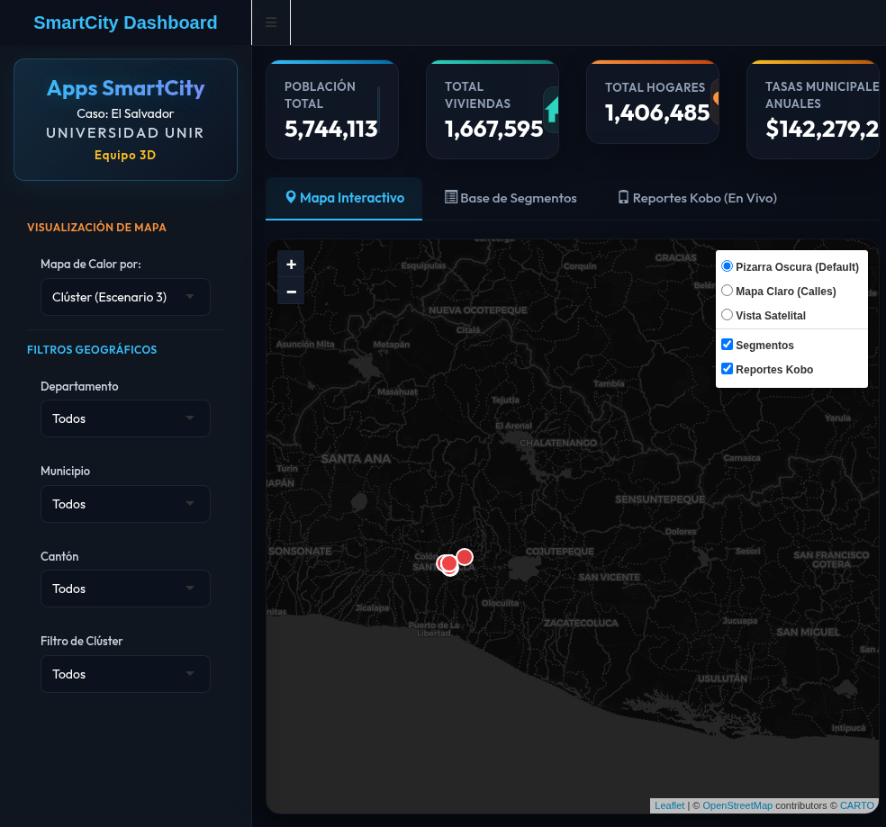{width=95%}

# Conclusiones y Recomendaciones de Planificación Gubernamental

1. **Planificación Científica Libre de Discrecionalidad**: El empleo combinado de Análisis de Componentes Principales (PCA) y K-Means (Escenario 3) provee un marco de estratificación territorial riguroso e inobjetable. Permite al Ministerio de Planificación y a las municipalidades focalizar la inversión en infraestructura y programas sociales con base en datos científicos consistentes a nivel de segmento catastral, erradicando la discrecionalidad política en la asignación de presupuestos.
2. **Mitigación Activa del Desarrollo Dual**: El análisis de departamentos como **La Libertad** demuestra que la proximidad física a polos metropolitanos de desarrollo no permean de manera natural a los segmentos rurales circundantes. El Estado debe intervenir activamente mediante políticas redistributivas y de saneamiento básico en los cinturones de vulnerabilidad de los municipios periféricos.
3. **Priorización Fiscal de Morazán y Ahuachapán**: Con base en las tasas de pobreza habitacional severa registradas en el Cluster 3 de Morazán (75.7%) y Ahuachapán (73.1%), y la alta prevalencia de población infantil y dependencia de leña, estos territorios deben recibir la máxima prioridad en la asignación del gasto social, planes de infraestructura sanitaria y transición energética nacional.
4. **Cierre de Brechas mediante la Integración Tecnológica (Smart Cities)**: La verdadera eficiencia de una administración gubernamental moderna radica en cruzar los datos estructurales del censo con la operatividad en tiempo real de la plataforma **Participación Ciudadana 4.0**. Al superponer los reportes de incidentes ciudadanos en KoboToolbox sobre el mapa de clústeres de vulnerabilidad aquí desarrollado, el Estado puede priorizar las cuadrillas de reparación en aquellos segmentos de mayor marginación (Clusters 1 y 3), logrando una gestión urbana equitativa y eficiente.
5. **Sostenibilidad del Modelo Analítico**: La escalabilidad computacional lineal $O(N)$ del K-Means aquí seleccionado garantiza que la infraestructura analítica del Estado pueda asimilar nuevas mediciones y actualizaciones del catastro sin requerir infraestructuras de supercómputo complejas, permitiendo mantener actualizado el mapa de prioridades territoriales del país a largo plazo.

## Plan de Implementación de la Solución Smart City (Cronograma de 6 Meses)

Para concretar la transición del prototipo a una solución plenamente operativa y desplegada a nivel gubernamental y local, se establece un plan de implementación estratégico estructurado para un período máximo de 6 meses. Este plan organiza el desarrollo técnico, la infraestructura, la participación comunitaria y el monitoreo mediante las siguientes etapas:

### Fases y Cronograma de Trabajo

* **Mes 1: Afinación del Desarrollo de la Aplicación en Shiny**
  - *Actividades*: Optimizar la velocidad de respuesta del backend en R Shiny, depurar la carga de datos del archivo geográfico `segmentos_c_cluster_esc3.rds`, refinar la paleta de colores para daltonismo y optimizar los popups del mapa Leaflet.
  - *Hito*: Código del dashboard optimizado y libre de fugas de memoria en pruebas locales.
* **Mes 2: Configuración del Servidor y Despliegue en Desarrollo (Staging)**
  - *Actividades*: Montaje de la infraestructura del servidor en Posit Connect, Shiny Server Open Source o servicio de nube equivalente. Creación de un entorno de staging/desarrollo restringido por credenciales para control de acceso y pruebas iniciales de concurrencia.
  - *Hito*: Plataforma disponible en URL privada para validación interna de los administradores del sistema.
* **Mes 3: Documentación Técnica y Pruebas Piloto Internas**
  - *Actividades*: Elaborar la documentación de la base de datos, del código fuente de Shiny y del flujo ETL. Iniciar las pruebas piloto internas con técnicos de planificación del Ministerio y planificadores municipales para validar la usabilidad de las búsquedas por ID de segmento y el mapa de calor.
  - *Hito*: Entrega de la documentación de la arquitectura y aprobación de usabilidad de los funcionarios de la fase piloto.
* **Mes 4: Pruebas Piloto con la Comunidad y Recopilación de Retroalimentación**
  - *Actividades*: Desplegar la aplicación de reporte ciudadano (KoboCollect) en las comunidades de prueba de Ahuachapán y Morazán. Capacitar a líderes comunitarios y ciudadanos seleccionados (comunidad denunciante) empleando el manual de usuario. Recopilar reportes reales y sistematizar la retroalimentación sobre la velocidad de carga, la facilidad de registro y el funcionamiento sin conexión.
  - *Hito*: Recepción de un mínimo de 100 reportes ciudadanos reales en la bandeja de entrada del dashboard.
* **Mes 5: Ajustes Técnicos y Mejoras Basadas en la Retroalimentación**
  - *Actividades*: Corregir los bugs reportados en el software de Shiny, ajustar las opciones del menú de filtros, optimizar el layout móvil para mejorar la experiencia de los denunciantes y afinar la conexión automatizada de la API de KoboToolbox frente a interrupciones de red.
  - *Hito*: Segunda versión del prototipo (v2) aprobada y lista para producción.
* **Mes 6: Puesta en Producción, Lanzamiento e Inicio del Seguimiento**
  - *Actividades*: Despliegue de la versión estable en el servidor de producción pública. Apertura oficial de la plataforma a la ciudadanía e integración del canal con las cuadrillas operativas de la alcaldía. Lanzamiento de las métricas de monitoreo mensual.
  - *Hito*: Lanzamiento oficial del sistema Smart City con reportes públicos habilitados y cuadrillas municipales asignadas según la prioridad de clústeres.

### Recursos Requeridos

1. **Recursos Humanos**:
   - *1 Desarrollador Shiny / Experto en R* (Responsable del afinamiento y la integración técnica).
   - *1 Ingeniero de Sistemas / Devops* (Montaje del servidor, API y seguridad).
   - *1 Analista SIG y Planificador Urbano* (Administrador del modelo de datos y priorización).
   - *1 Enlace Social/Comunitario* (Coordinador del pilotaje con la comunidad y levantamiento de feedback).
   - *Equipos Municipales de Mantenimiento* (Para la atención y resolución de los incidentes recibidos).
2. **Recursos Tecnológicos e Infraestructura**:
   - Servidor web dedicado (Posit Connect, Shinyapps.io Professional o Shiny Server VPS local).
   - Servidor y cuenta institucional en KoboToolbox (servidor humanitario global kf).
   - Dispositivos móviles con GPS integrado para el personal municipal de inspección y líderes comunitarios clave.
   - Conectividad a Internet/Wi-Fi en las oficinas centrales de planificación.
3. **Recursos Operativos y Financieros**:
   - Presupuesto para talleres de capacitación y distribución digital del manual del usuario.
   - Presupuesto operativo para el desplazamiento del enlace social al territorio rural prioritario.

### Métricas de Seguimiento y Monitoreo

Para evaluar el impacto de la plataforma Smart City y asegurar que cumpla con el principio de equidad territorial, se establecen las siguientes métricas clave de rendimiento:

* **Tasa de Respuesta de Cuadrillas Municipales (SLA)**:
  - *Definición*: Tiempo promedio transcurrido desde la recepción y validación de una denuncia en KoboToolbox hasta la intervención de la cuadrilla municipal.
  - *Meta*: Menor a 48 horas para segmentos de los Clústeres 1 y 3 (prioridad de alta vulnerabilidad) y menor a 72 horas en el Clúster 2.
* **Tasa de Cobertura de Denuncias en Zonas Vulnerables**:
  - *Definición*: Porcentaje de segmentos del Clúster 3 que registran al menos una denuncia ciudadana o reporte de infraestructura activa al mes.
  - *Meta*: Mayor al 85% de los segmentos prioritarios al finalizar el mes 6, garantizando que no existan "zonas de silencio" en los microdatos.
* **Índice de Resolución de Incidentes**:
  - *Definición*: Relación porcentual entre denuncias catalogadas como "Resueltas" y el total de denuncias "Recibidas" durante el período de medición.
  - *Meta*: Mantener un índice de resolución mensual superior al 90%.
* **Índice de Satisfacción Ciudadana (Retroalimentación)**:
  - *Definición*: Calificación promedio otorgada por los ciudadanos denunciantes mediante un formulario de cierre sobre la calidad de la reparación y el tiempo de atención (escala 1 a 5).
  - *Meta*: Promedio superior a 4.2.
* **Relación Costo-Beneficio de Recaudación vs Reparación**:
  - *Definición*: Comparación entre la recaudación potencial de tasas municipales ($7.11/vivienda/mes) en el segmento y la asignación real del costo de reparación de infraestructura reportada, optimizando la balanza comercial de la alcaldía.

# Referencias Bibliográficas

Cardullo, P., & Kitchin, R. (2019). Being a 'citizen' in the smart city: up and down the scaffold of smart citizen participation in Dublin, Ireland. *GeoJournal*, 84(1), 1–13. https://doi.org/10.1007/s10708-018-9845-8

Cheng, J., & Karambelkar, B., & Xie, Y. (2023). *leaflet: Create Interactive Web Maps with the JavaScript 'Leaflet' Library*. R Package Version 2.2.0. https://CRAN.R-project.org/package=leaflet

Dirección General de Estadística y Censos (DIGESTYC). (2008). *VI Censo de Población y V de Vivienda 2007: Resultados Nacionales*. Ministerio de Economía de la República de El Salvador.

Hartigan, J. A., & Wong, M. A. (1979). Algorithm AS 136: A K-Means Clustering Algorithm. *Journal of the Royal Statistical Society. Series C (Applied Statistics)*, 28(1), 100–108. https://doi.org/10.2307/2346830

James, G., & Witten, D., & Hastie, T., & Tibshirani, R. (2013). *An Introduction to Statistical Learning: with Applications in R*. Springer. https://doi.org/10.1007/978-1-4614-7138-7

Kassambara, A. (2020). *Practical Guide to Cluster Analysis in R: Unsupervised Machine Learning*. STHDA.

KoboToolbox. (2026). *KoboToolbox: Data collection tool for challenging environments*. Harvard Humanitarian Initiative / Kobo Association. https://www.kobotoolbox.org/

Morozov, E. (2013). *To Save Everything, Click Here: The Folly of Technological Solutionism*. PublicAffairs.

Pebesma, E. (2018). Simple Features for R: Standardized Support for Spatial Vector Data. *The R Journal*, 10(1), 439–446. https://doi.org/10.32614/RJ-2018-009

R Core Team. (2023). *R: A Language and Environment for Statistical Computing*. R Foundation for Statistical Computing. https://www.R-project.org/

Townsend, A. M. (2013). *Smart Cities: Big Data, Civic Hackers, and the Quest for a New Utopia*. W. W. Norton & Company.

# Anexos: Código de Preparación, Procesamiento y Agrupamiento de Datos

En esta sección se adjunta la totalidad del código fuente programado en lenguaje R que sirvió como base para la construcción del modelo catastral y del tablero interactivo de visualización geoespacial. Esta documentación garantiza la total reproducibilidad y transparencia metodológica del análisis.

## Anexo A: ETL de Datos Demográficos y Poblacionales (Script.R)

Este script procesa la base de datos de población individual del censo (`poblacion.sav`), genera las categorizaciones de ciclo de vida (edad) y consolida la agregación a nivel de segmentos geográficos (`seg01.rds`).

```r
#=========================================================
# 1. Cargar librerías requeridas
#=========================================================
library(tidyverse)
library(haven)
library(sjmisc)

#=========================================================
# 2. Cargar y Optimizar Base de Datos de Población
#=========================================================
# Se importan los datos originales en formato SPSS y se convierten a factores de R
bd <- read_sav("poblacion.sav") %>% as_factor()
saveRDS(bd, "poblacion.rds")

# En futuras sesiones se lee instantáneamente el archivo comprimido RDS
bdp <- readRDS("poblacion.rds")

#=========================================================
# 3. Transformación y Construcción de Indicadores
#=========================================================
bdp <- bdp %>%
  mutate(
    # Conversión temporal de edad para clasificación por ciclo de vida
    edad_temp = as.numeric(as.character(S06P03A)),
    Rango_Edad = case_when(
      edad_temp >= 0  & edad_temp <= 5  ~ 1, # Primera Infancia
      edad_temp >= 6  & edad_temp <= 11 ~ 2, # Niñez
      edad_temp >= 12 & edad_temp <= 17 ~ 3, # Adolescencia
      edad_temp >= 18 & edad_temp <= 59 ~ 4, # Mano de Obra Activa
      edad_temp >= 60 ~ 5,                  # Adulto Mayor
      TRUE ~ NA_real_
    ),
    # Creación de variables indicadoras binarias (dummy)
    De_0_5_Años    = if_else(Rango_Edad == 1, 1, 0, missing = 0),
    De_6_11_Años   = if_else(Rango_Edad == 2, 1, 0, missing = 0),
    De_12_17_Años  = if_else(Rango_Edad == 3, 1, 0, missing = 0),
    De_18_59_Años  = if_else(Rango_Edad == 4, 1, 0, missing = 0),
    De_60_mas_Años = if_else(Rango_Edad == 5, 1, 0, missing = 0),
    Hogar          = if_else(as.numeric(as.character(S06P01)) == 1, 1, 0, missing = 0),
    Tasa_Municipal = 7.11,
    Ingreso_Tasa_Municipal = Hogar * Tasa_Municipal,
    Seg_id         = str_c(cod_mun4, SEGID), # Construcción de ID único de segmento
    Poblacion      = 1
  ) %>%
  select(-edad_temp)

#=========================================================
# 4. Agregación Espacial a Nivel de Segmento
#=========================================================
dbseg <- bdp %>%
  group_by(Seg_id, REGIONID, REGIONDSC, DEPID, DEPDSC, MUNID, MUNDSC, CANID, CANDSC, AREAID, AREADSC) %>%
  summarise(
    Poblacion      = sum(Poblacion, na.rm = TRUE),
    Hogar          = sum(Hogar, na.rm = TRUE),
    De_0_5_Años    = sum(De_0_5_Años, na.rm = TRUE),
    De_6_11_Años   = sum(De_6_11_Años, na.rm = TRUE),
    De_12_17_Años  = sum(De_12_17_Años, na.rm = TRUE),
    De_18_59_Años  = sum(De_18_59_Años, na.rm = TRUE),
    De_60_mas_Años = sum(De_60_mas_Años, na.rm = TRUE),
    CorredorSeco   = sum(as.numeric(as.character(CorredorSeco)), na.rm = TRUE),
    .groups = "drop"
  )

# Guardar base de datos demográfica agregada
saveRDS(dbseg, "seg01.rds")
```

## Anexo B: ETL de Viviendas, Hogares y Consolidación Catastral (Script_v.R)

Este script procesa los archivos de microdatos residenciales (`vivienda.sav`) y familiares (`hogar.sav`), calcula las privaciones y unifica todas las bases sobre la cartografía catastral para exportar el set final de 12,406 filas.

```r
library(tidyverse)
library(haven)
library(sjmisc)

#=========================================================
# 1. ETL de Vivienda y Medición de Necesidades Básicas
#=========================================================
bdv <- read_sav("vivienda.sav") %>% as_factor()
saveRDS(bdv, "vivienda.rds")
bdv <- readRDS("vivienda.rds")

bdv <- bdv %>%
  mutate(
    Seg_id                 = str_c(cod_mun4, SEGID),
    Viviendas              = 1,
    Carencia_Tipo_Vivienda = if_else(as.numeric(S02P01) > 2, 1, 0),
    Carencia_Paredes       = if_else(as.numeric(S02P02) > 1, 1, 0),
    Carencia_Techos        = if_else(as.numeric(S02P03) > 1, 1, 0),
    Carencia_Piso          = if_else(as.numeric(S02P05) > 3, 1, 0),
    Hacinamiento           = if_else(as.numeric(S02P06) > 6, 1, 0),
    Suma_Carencias         = Carencia_Tipo_Vivienda + Carencia_Paredes + Carencia_Techos + Carencia_Piso + Hacinamiento,
    Pobreza_Carencia       = if_else(Suma_Carencias > 1, 1, 0)
  )

# Agregación por Segmento (Viviendas)
segv <- bdv %>%
  group_by(Seg_id) %>%
  summarise(
    Viviendas              = sum(Viviendas, na.rm = TRUE),
    Carencia_Tipo_Vivienda = sum(Carencia_Tipo_Vivienda, na.rm = TRUE),
    Carencia_Paredes       = sum(Carencia_Paredes, na.rm = TRUE),
    Carencia_Techos        = sum(Carencia_Techos, na.rm = TRUE),
    Carencia_Piso          = sum(Carencia_Piso, na.rm = TRUE),
    Hacinamiento           = sum(Hacinamiento, na.rm = TRUE),
    Suma_Carencias         = sum(Suma_Carencias, na.rm = TRUE),
    Pobreza_Carencia       = sum(Pobreza_Carencia, na.rm = TRUE),
    .groups = "drop"
  )
saveRDS(segv, "seg02.rds")

#=========================================================
# 2. ETL de Hogar (Servicios Básicos y Conectividad)
#=========================================================
bdh <- read_sav("hogar.sav") %>% as_factor()
saveRDS(bdh, "hogar.rds")
bdh <- readRDS("hogar.rds")

bdh <- bdh %>%
  mutate(
    SEG_ID                      = str_c(cod_mun4, SEGID),
    Servicio_Inodoro            = if_else(as.numeric(S03P05) == 1, 1, 0),
    Servicio_Agua_Potable       = if_else(as.numeric(S03P08) == 1, 1, 0),
    Combustible_Cocinar         = if_else(as.numeric(S03P10) < 3, 1, 0),
    Combustible_Cocinar_Leña    = if_else(as.numeric(S03P10) == 4, 1, 0),
    Servicio_Electricidad       = if_else(as.numeric(S03P11) == 1, 1, 0),
    Servicio_Recoleccion_Basura = if_else(as.numeric(S03P12) == 1, 1, 0),
    Posee_Celular               = if_else(as.numeric(S03P13C) == 1, 1, 0),
    Servicio_Cable              = if_else(as.numeric(S03P13L) == 1, 1, 0),
    Servicio_Internet           = if_else(as.numeric(S03P13M) == 1, 1, 0),
    Actividad_Hogar_Agricola    = if_else(as.numeric(S03P15A) == 1 | as.numeric(S03P15B) == 1, 1, 0)
  )

# Agregación por Segmento (Hogares)
seg07 <- bdh %>%
  group_by(SEG_ID) %>%
  summarise(
    Servicio_Inodoro            = sum(Servicio_Inodoro, na.rm = TRUE),
    Servicio_Agua_Potable       = sum(Servicio_Agua_Potable, na.rm = TRUE),
    Combustible_Cocinar         = sum(Combustible_Cocinar, na.rm = TRUE),
    Combustible_Cocinar_Leña    = sum(Combustible_Cocinar_Leña, na.rm = TRUE),
    Servicio_Electricidad       = sum(Servicio_Electricidad, na.rm = TRUE),
    Servicio_Recoleccion_Basura = sum(Servicio_Recoleccion_Basura, na.rm = TRUE),
    Posee_Celular               = sum(Posee_Celular, na.rm = TRUE),
    Servicio_Cable              = sum(Servicio_Cable, na.rm = TRUE),
    Servicio_Internet           = sum(Servicio_Internet, na.rm = TRUE),
    Actividad_Hogar_Agricola    = sum(Actividad_Hogar_Agricola, na.rm = TRUE),
    .groups = "drop"
  )

#=========================================================
# 3. Concatenación de Bases e Integración Geográfica
#=========================================================
seg01 <- readRDS("seg01.rds")
seg02 <- readRDS("seg02.rds")
seg03 <- readRDS("segmentos_opt.rds") # Shapefile geometries

seg04   <- left_join(seg02, seg01, by = join_by("Seg_id" == "Seg_id"))
seg04.1 <- seg04 %>% select(c(-10:-19))
seg05   <- seg03 %>% select(c(-5:-12, -14:-17))
seg06   <- left_join(seg05, seg04.1, by = join_by("SEG_ID" == "Seg_id"))
seg08   <- left_join(seg06, seg07, by = join_by("SEG_ID" == "SEG_ID"))

seg08 <- seg08 %>%
  mutate(
    Ingreso_Tasas_Municipales = coalesce(Viviendas, 0) * 7.11
  ) %>% 
  select(SEG_ID, CANTON, Depto_Norm, Mpio_Norm, Viviendas, Poblacion, Hogar, everything())

saveRDS(seg08, "segmentacion_caracterizado.rds")
```

## Anexo C: Análisis de Componentes Principales (PCA) y Clustering K-Means (Cluster.R)

Este script realiza la reducción dimensional (PCA) y ejecuta la segmentación territorial comparativa, recomendando matemáticamente la selección del modelo K-Means con $k=3$ (Escenario 3).

```r
library(tidyverse)
library(cluster)
library(factoextra)
library(sjmisc)
library(ggpubr)

#=========================================================
# 1. Preparación de Datos Numéricos
#=========================================================
bdsegc <- readRDS("segmentacion_caracterizado.rds")

bd_num_pre <- bdsegc %>%
  as.data.frame() %>%
  select(where(is.numeric)) %>%
  select(-any_of(c("REGIONID", "DEPID", "MUNID", "CANID", "AREAID", "SEGID", "Seg_id", "SEG_ID", "cod_mun4", "cod_dep2", "Tasa_Municipal")))

# Filtrado de variables con más de 20% NA
umbral_na <- nrow(bdsegc) * 0.20
vars_validas <- names(bd_num_pre)[colSums(is.na(bd_num_pre)) <= umbral_na]

# Depuración por casos completos y eliminación de variables constantes
bd_proc <- bdsegc %>%
  drop_na(all_of(vars_validas)) %>%
  filter(if_all(all_of(vars_validas), is.finite))

bd_num <- bd_proc %>%
  as.data.frame() %>%
  select(all_of(vars_validas)) %>%
  select(where(~ n_distinct(.x) > 1))

#=========================================================
# 2. Análisis de Componentes Principales (PCA)
#=========================================================
res_pca <- prcomp(bd_num, scale. = TRUE)

# Selección de variables con contribución superior a la media en Dim 1 y Dim 2
var_info <- get_pca_var(res_pca)
contrib_mat <- as.matrix(var_info$contrib)
contrib_sum <- rowSums(contrib_mat[, 1:min(2, ncol(contrib_mat)), drop = FALSE])
vars_seleccionadas <- names(which(contrib_sum >= mean(contrib_sum)))

# Subset normalizado para agrupamiento
datos_cluster <- bd_num %>% select(all_of(vars_seleccionadas))
datos_scaled  <- scale(datos_cluster)

#=========================================================
# 3. Modelado Escenario 3: Algoritmo K-Means (Óptimo)
#=========================================================
set.seed(123) # Reproducibilidad
kmeans_model <- kmeans(datos_scaled, centers = 3, nstart = 25)

# Guardar base con clúster asignado
segmentos_c_cluster_esc3 <- bd_proc %>%
  mutate(Cluster_Escenario3 = as.factor(kmeans_model$cluster))

saveRDS(segmentos_c_cluster_esc3, "segmentos_c_cluster_esc3.rds")

#=========================================================
# 4. Evaluación de Calidad Geométrica (Silueta Promedio)
#=========================================================
dist_mat <- dist(datos_scaled, method = "euclidean")
sil_esc3 <- cluster::silhouette(kmeans_model$cluster, dist_mat)
promedio_sil_esc3 <- mean(sil_esc3[, "sil_width"])

cat("Ancho de Silueta Promedio Escenario 3:", round(promedio_sil_esc3, 4), "\n")
```

## Anexo D: Código del Tablero de Control Interactivo Shiny (app (1).R)

A continuación, se documenta el código completo de la interfaz de usuario (`ui`) y lógica del servidor (`server`) de la plataforma **Participación Ciudadana 4.0** programada en R Shiny, el cual se nutre en tiempo real de la API de KoboToolbox y de la base geográfica clasificada:

```r
#======================================================================
#----------------------------- APPS SmartCity
#----------------- UNIR - Equipo 3D (Teis_Unir_Rv2)
#====================================================================

library(shiny)
library(shinydashboard)
library(leaflet)
library(sf)
library(dplyr)
library(readr)
library(tidyr)
library(DT)
library(stringr)

# 1. CARGA DE BASE GEOGRÁFICA OPTIMIZADA
segs <- readRDS("segmentos_c_cluster_esc3.rds") %>%
  mutate(Ingreso_Tasas_Anual = Ingreso_Tasas_Municipales * 12)

# Extraer columnas numéricas de la base segmentos para el Mapa de Calor
numeric_cols <- segs %>%
  st_drop_geometry() %>%
  select(where(is.numeric)) %>%
  colnames()

# Mapear etiquetas descriptivas en español
friendly_labels <- c(
  "Poblacion" = "Población Total",
  "Viviendas" = "Viviendas Totales",
  "Hogar" = "Hogares Totales",
  "Carencia_Tipo_Vivienda" = "Carencia: Tipo de Vivienda",
  "Carencia_Paredes" = "Carencia: Paredes Deficientes",
  "Carencia_Techos" = "Carencia: Techo Deficiente",
  "Carencia_Piso" = "Carencia: Piso Deficiente",
  "Hacinamiento" = "Hacinamiento en Hogares",
  "Suma_Carencias" = "Carencias Acumuladas",
  "Pobreza_Carencia" = "Pobreza por Carencias",
  "De_0_5_Años" = "Concentración: Edad 0 a 5 años",
  "De_6_11_Años" = "Concentración: Edad 6 a 11 años",
  "De_12_17_Años" = "Concentración: Edad 12 a 17 años",
  "De_18_59_Años" = "Concentración: Edad 18 a 59 años",
  "De_60_mas_Años" = "Concentración: Edad 60+ años",
  "CorredorSeco" = "Población en Corredor Seco",
  "Servicio_Inodoro" = "Servicios: Inodoro Conectado",
  "Servicio_Agua_Potable" = "Servicios: Acceso Agua Potable",
  "Combustible_Cocinar" = "Combustible: Gas para Cocinar",
  "Combustible_Cocinar_Leña" = "Combustible: Cocinar con Leña",
  "Servicio_Electricidad" = "Servicios: Acceso Electricidad",
  "Servicio_Recoleccion_Basura" = "Servicios: Recolección Basura",
  "Posee_Celular" = "Acceso: Posee Celular",
  "Servicio_Cable" = "Acceso: Televisión por Cable",
  "Servicio_Internet" = "Acceso: Servicio Internet",
  "Actividad_Hogar_Agricola" = "Actividad: Hogar Agrícola",
  "Ingreso_Tasas_Municipales" = "Recaudación de Tasas ($)",
  "Ingreso_Tasas_Anual" = "Recaudación de Tasas Anual ($)"
)

# Inicializar Mapa de Calor con variable de clúster por defecto
map_var_choices <- c("Clúster (Escenario 3)" = "Cluster_Escenario3")

# Rellenar con variables numéricas detectadas
for (col in numeric_cols) {
  lbl <- if (col %in% names(friendly_labels)) friendly_labels[[col]] else gsub("_", " ", col)
  map_var_choices[lbl] <- col
}

# Preparar listas territoriales
deptos_choices <- c("Todos", sort(unique(segs$Depto_Norm)))
cluster_choices <- c("Todos", sort(unique(as.character(segs$Cluster_Escenario3))))

format_num <- function(x) {
  format(round(x), big.mark = ",", scientific = FALSE)
}
format_currency <- function(x) {
  paste0("$", format(round(x, 2), big.mark = ",", decimal.mark = ".", scientific = FALSE))
}

# 2. INTERFAZ DE USUARIO (UI)
ui <- dashboardPage(
  skin = "black",
  dashboardHeader(title = "SmartCity Dashboard", titleWidth = 280),
  
  dashboardSidebar(
    width = 280,
    div(class = "brand-panel",
        h2("Apps SmartCity"),
        div(class = "sub-caso", "Caso: El Salvador"),
        div(class = "sub-unir", "Universidad UNIR"),
        div(class = "sub-team", "Equipo 3D")
    ),
    
    sidebarMenu(
      id = "side_menu",
      div(style = "padding: 10px 15px; max-height: calc(100vh - 200px); overflow-y: auto;",
          h4("Visualización de Mapa", style = "margin-bottom:12px; color:#fb923c; font-weight:600; text-transform:uppercase; font-size:12px; letter-spacing:0.5px;"),
          selectInput("map_var", "Mapa de Calor por:", choices = map_var_choices, selected = "Cluster_Escenario3"),
          
          hr(style = "border-color: rgba(255,255,255,0.05); margin: 15px 0;"),
          h4("Filtros Geográficos", style = "margin-bottom:12px; color:#38bdf8; font-weight:600; text-transform:uppercase; font-size:12px; letter-spacing:0.5px;"),
          selectInput("depto", "Departamento", choices = deptos_choices, selected = "Todos"),
          selectInput("muni", "Municipio", choices = c("Todos"), selected = "Todos"),
          selectInput("canton", "Cantón", choices = c("Todos"), selected = "Todos"),
          selectInput("cluster", "Filtro de Clúster", choices = cluster_choices, selected = "Todos"),
          selectizeInput("seg_id", "Buscar ID de Segmento", choices = NULL, options = list(placeholder = 'Escribe para buscar...')),
          
          hr(style = "border-color: rgba(255,255,255,0.05); margin: 15px 0;"),
          actionButton("reset_btn", "Restablecer Filtros", icon = icon("refresh", lib = "glyphicon"), class = "btn-warning btn-block")
      )
    )
  ),
  
  dashboardBody(
    tags$head(
      tags$link(rel = "stylesheet", type = "text/css", href = "custom.css"),
      tags$style(type = "text/css", ".content-wrapper { padding-top: 0px !important; }")
    ),
    
    uiOutput("indicators_ui"),
    
    fluidRow(
      column(12,
             tabsetPanel(
               id = "main_tabs",
               tabPanel(title = span(icon("map-marker", lib = "glyphicon"), "Mapa Interactivo"),
                        div(style = "position: relative; margin-top: 15px;",
                            leafletOutput("mapa", height = "640px")
                        )
               ),
               tabPanel(title = span(icon("list-alt", lib = "glyphicon"), "Base de Segmentos"),
                        div(class = "glass-panel", style = "margin-top: 15px;",
                            h3(class = "glass-card-title", icon("th-list", lib = "glyphicon"), "Caracterización Geográfica de Segmentos"),
                            DT::dataTableOutput("tabla_segmentos")
                        )
               ),
               tabPanel(title = span(icon("phone", lib = "glyphicon"), "Reportes Kobo (En Vivo)"),
                        div(class = "glass-panel", style = "margin-top: 15px;",
                            h3(class = "glass-card-title", icon("exclamation-sign", lib = "glyphicon"), "Bandeja de Denuncias Ciudadanas Recibidas"),
                            DT::dataTableOutput("tabla_kobo")
                        )
               )
             )
      )
    )
  )
)

# 3. LÓGICA DEL SERVIDOR (SERVER)
server <- function(input, output, session) {
  updateSelectizeInput(session, "seg_id", choices = c("Todos", sort(unique(segs$SEG_ID))), selected = "Todos", server = TRUE)
  
  observeEvent(input$depto, {
    if (input$depto == "Todos") {
      muni_choices <- "Todos"
      seg_choices <- c("Todos", sort(unique(segs$SEG_ID)))
    } else {
      muni_choices <- c("Todos", sort(unique(segs$Mpio_Norm[segs$Depto_Norm == input$depto])))
      seg_choices <- c("Todos", sort(unique(segs$SEG_ID[segs$Depto_Norm == input$depto])))
    }
    updateSelectInput(session, "muni", choices = muni_choices, selected = "Todos")
    updateSelectInput(session, "canton", choices = "Todos", selected = "Todos")
    updateSelectizeInput(session, "seg_id", choices = seg_choices, selected = "Todos", server = TRUE)
  })
  
  observeEvent(input$muni, {
    if (input$muni == "Todos") {
      canton_choices <- "Todos"
      if (input$depto == "Todos") {
        seg_choices <- c("Todos", sort(unique(segs$SEG_ID)))
      } else {
        seg_choices <- c("Todos", sort(unique(segs$SEG_ID[segs$Depto_Norm == input$depto])))
      }
    } else {
      canton_choices <- c("Todos", sort(unique(segs$CANTON[segs$Mpio_Norm == input$muni])))
      seg_choices <- c("Todos", sort(unique(segs$SEG_ID[segs$Mpio_Norm == input$muni])))
    }
    updateSelectInput(session, "canton", choices = canton_choices, selected = "Todos")
    updateSelectizeInput(session, "seg_id", choices = seg_choices, selected = "Todos", server = TRUE)
  })
  
  observeEvent(input$canton, {
    if (input$canton == "Todos") {
      if (input$muni == "Todos") {
        if (input$depto == "Todos") {
          seg_choices <- c("Todos", sort(unique(segs$SEG_ID)))
        } else {
          seg_choices <- c("Todos", sort(unique(segs$SEG_ID[segs$Depto_Norm == input$depto])))
        }
      } else {
        seg_choices <- c("Todos", sort(unique(segs$SEG_ID[segs$Mpio_Norm == input$muni])))
      }
    } else {
      seg_choices <- c("Todos", sort(unique(segs$SEG_ID[segs$CANTON == input$canton & segs$Mpio_Norm == input$muni])))
    }
    updateSelectizeInput(session, "seg_id", choices = seg_choices, selected = "Todos", server = TRUE)
  })
  
  filtered_segs <- reactive({
    df <- segs
    if (input$depto != "Todos") df <- df %>% filter(Depto_Norm == input$depto)
    if (input$muni != "Todos")  df <- df %>% filter(Mpio_Norm == input$muni)
    if (input$canton != "Todos") df <- df %>% filter(CANTON == input$canton)
    if (input$cluster != "Todos") df <- df %>% filter(Cluster_Escenario3 == input$cluster)
    if (input$seg_id != "Todos")  df <- df %>% filter(SEG_ID == input$seg_id)
    df
  })
  
  kobo_timer <- reactiveTimer(30000)
  
  kobo_data <- reactive({
    kobo_timer()
    url <- "https://kf.kobotoolbox.org/api/v2/assets/aQWCaWdPejowRnATj3GsoV/export-settings/esqB6iBP2JP2yWYorQ3eYoF/data.csv"
    tryCatch({
      df <- read_delim(url, delim = ";", escape_double = FALSE, trim_ws = TRUE, show_col_types = FALSE)
      cols_prob <- intersect(colnames(df), c("PROBLEMA_01", "PROBLEMA_02", "PROBLEMA_03", "PROBLEMA_04", "PROBLEMA_05", "PROBLEMA_06", "OTRO_PROBLEMA_01", "OTRO_PROBLEMA_02", "OTRO_PROBLEMA_03", "OTRO_PROBLEMA_04", "OTRO_PROBLEMA_05"))
      df <- df %>% mutate(across(any_of(cols_prob), as.character))
      
      df$Problema_Reportado <- apply(df[, cols_prob], 1, function(row) {
        vals <- row[!is.na(row) & row != "" & row != "NA" & row != "NULL"]
        if (length(vals) == 0) return("Sin especificar")
        paste(vals, collapse = ", ")
      })
      
      df <- df %>%
        mutate(
          Latitud = as.numeric(`_UBICACION_DENUNCIA_latitude`),
          Longitud = as.numeric(`_UBICACION_DENUNCIA_longitude`),
          Codigo = `_id`,
          Fecha = FECHA_DENUNCIA,
          Foto_URL = FotoReferencia_1_URL
        ) %>%
        filter(!is.na(Latitud) & !is.na(Longitud))
      
      if (nrow(df) > 0) {
        df$Popup_HTML <- sapply(1:nrow(df), function(i) {
          row <- df[i, ]
          img_html <- if (!is.na(row$Foto_URL) && row$Foto_URL != "" && row$Foto_URL != "NA" && row$Foto_URL != "NULL") {
            paste0("<a href='", row$Foto_URL, "' target='_blank'></a>")
          } else {
            "<div style='color:#94a3b8; font-size:12px; margin-bottom:10px;'>Sin Fotografía</div>"
          }
          paste0(
            "<div class='map-popup-card'>",
            "<div class='map-popup-header'>Reporte Kobo #", row$Codigo, "</div>",
            img_html,
            "<div><b>Problema:</b> ", row$Problema_Reportado, "</div>",
            "<div><b>Fecha:</b> ", row$Fecha, "</div>",
            "</div>"
          )
        })
      } else {
        df$Popup_HTML <- character(0)
      }
      df
    }, error = function(e) {
      return(data.frame())
    })
  })
  
  output$indicators_ui <- renderUI({
    df <- filtered_segs()
    pop_val <- sum(df$Poblacion, na.rm = TRUE)
    viv_val <- sum(df$Viviendas, na.rm = TRUE)
    hog_val <- sum(df$Hogar, na.rm = TRUE)
    tasas_val <- sum(df$Ingreso_Tasas_Anual, na.rm = TRUE)
    
    fluidRow(
      column(3, div(class = "smart-value-box box-blue", h3(format_num(pop_val)), p("Población Total"))),
      column(3, div(class = "smart-value-box box-teal", h3(format_num(viv_val)), p("Viviendas Totales"))),
      column(3, div(class = "smart-value-box box-orange", h3(format_num(hog_val)), p("Hogares Totales"))),
      column(3, div(class = "smart-value-box box-amber", h3(format_currency(tasas_val)), p("Tasas Anuales ($)")))
    )
  })
  
  output$mapa <- renderLeaflet({
    leaflet() %>%
      addMapPane("segmentos_pane", zIndex = 410) %>%
      addMapPane("kobo_pane", zIndex = 450) %>%
      addProviderTiles(providers$CartoDB.DarkMatter, group = "Pizarra Oscura (Default)") %>%
      addTiles(group = "Mapa Claro (Calles)") %>%
      setView(lat = 13.794, lng = -88.896, zoom = 9) %>%
      addLayersControl(
        baseGroups = c("Pizarra Oscura (Default)", "Mapa Claro (Calles)"),
        overlayGroups = c("Segmentos", "Reportes Kobo"),
        options = layersControlOptions(collapsed = FALSE)
      )
  })
  
  reactive_pal_info <- reactive({
    var_name <- input$map_var
    df_segs <- filtered_segs()
    if (nrow(df_segs) == 0) return(NULL)
    vals <- df_segs[[var_name]]
    
    if (var_name == "Cluster_Escenario3") {
      pal <- colorFactor(palette = c("#fbbf24", "#38bdf8", "#34d399"), domain = segs$Cluster_Escenario3)
      return(list(pal = pal, type = "factor", title = "Clúster"))
    } else {
      pal <- colorNumeric(palette = "YlOrRd", domain = range(vals, na.rm = TRUE))
      return(list(pal = pal, type = "numeric", title = var_name))
    }
  })
  
  observe({
    proxy <- leafletProxy("mapa")
    proxy %>% clearShapes() %>% clearControls()
    df_segs <- filtered_segs()
    pal_info <- reactive_pal_info()
    if (is.null(pal_info) || nrow(df_segs) == 0) return()
    
    var_name <- input$map_var
    pal <- pal_info$pal
    
    if (nrow(df_segs) > 1200) {
      showNotification("Por favor selecciona filtros más específicos para ver el mapa.", type = "message", id = "depto_notif")
    } else {
      bbox <- st_bbox(df_segs)
      proxy %>% flyToBounds(bbox[["xmin"]], bbox[["ymin"]], bbox[["xmax"]], bbox[["ymax"]])
      
      proxy %>% addPolygons(
        data = df_segs,
        fillColor = ~pal(df_segs[[var_name]]),
        fillOpacity = 0.6,
        color = "#ffffff",
        weight = 1,
        popup = ~paste0("Segmento: ", SEG_ID, "<br>Municipio: ", Mpio_Norm),
        options = pathOptions(pane = "segmentos_pane"),
        group = "Segmentos"
      )
      
      proxy %>% addLegend(
        position = "bottomleft",
        pal = pal,
        values = df_segs[[var_name]],
        title = pal_info$title,
        group = "Segmentos"
      )
    }
  })
  
  observe({
    proxy <- leafletProxy("mapa")
    proxy %>% clearMarkers()
    df_kobo <- kobo_data()
    if (nrow(df_kobo) > 0) {
      proxy %>% addCircleMarkers(
        data = df_kobo,
        lng = ~Longitud,
        lat = ~Latitud,
        radius = 8,
        fillColor = "#ef4444",
        color = "#ffffff",
        weight = 1.5,
        popup = ~Popup_HTML,
        options = pathOptions(pane = "kobo_pane"),
        group = "Reportes Kobo"
      )
    }
  })
  
  output$tabla_segmentos <- DT::renderDataTable({
    df_table <- filtered_segs() %>%
      st_drop_geometry() %>%
      select(SEG_ID, Depto_Norm, Mpio_Norm, CANTON, Cluster_Escenario3, Poblacion, Viviendas, Hogar, Ingreso_Tasas_Municipales)
    
    DT::datatable(df_table, rownames = FALSE, style = 'bootstrap')
  })
  
  output$tabla_kobo <- DT::renderDataTable({
    df_kobo_table <- kobo_data() %>% select(Codigo, Fecha, AREA_PROBLEMA, Problema_Reportado)
    DT::datatable(df_kobo_table, rownames = FALSE, style = 'bootstrap')
  })
  
  observeEvent(input$reset_btn, {
    updateSelectizeInput(session, "seg_id", choices = c("Todos", sort(unique(segs$SEG_ID))), selected = "Todos", server = TRUE)
    updateSelectInput(session, "map_var", selected = "Cluster_Escenario3")
    updateSelectInput(session, "depto", selected = "Todos")
    leafletProxy("mapa") %>% setView(lat = 13.794, lng = -88.896, zoom = 9)
  })
}

shinyApp(ui = ui, server = server)
```
